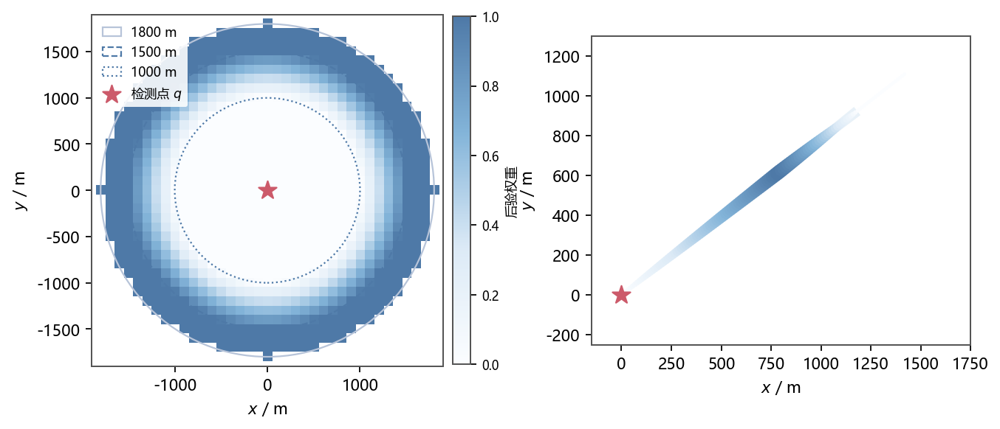
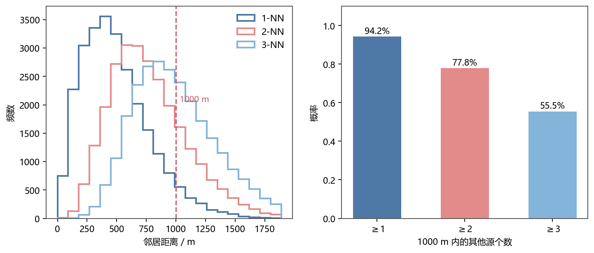
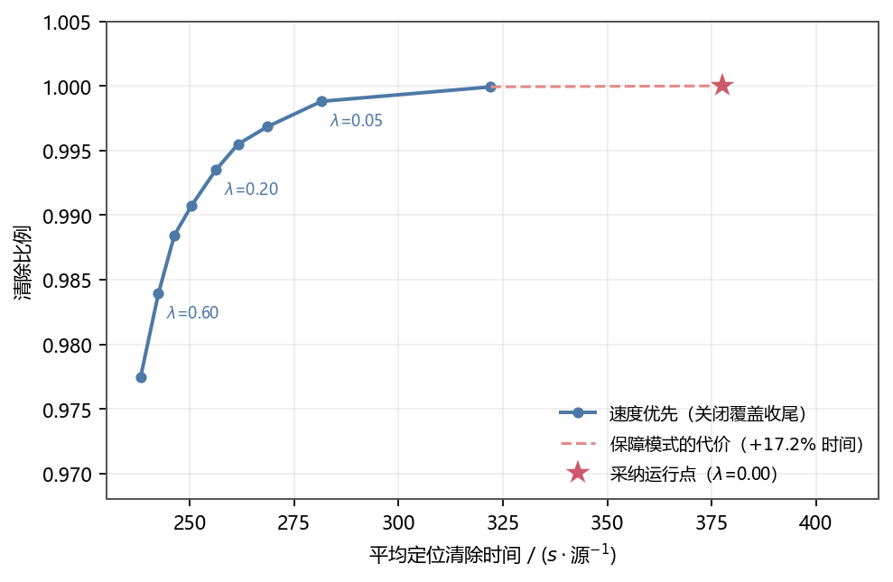
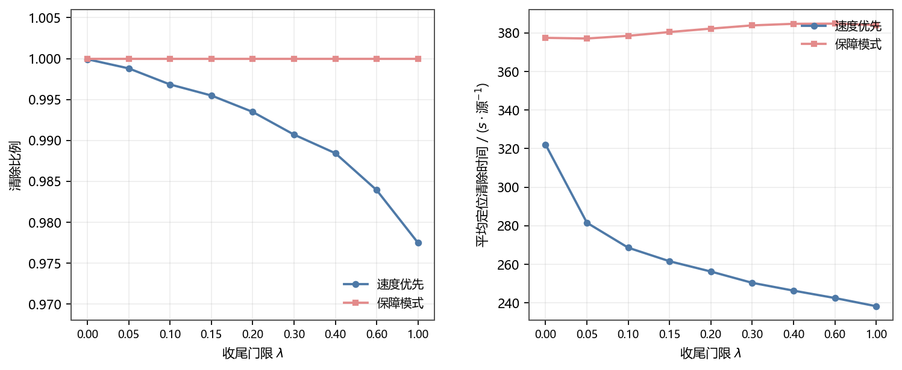

# 问题3 全向干扰源的自动搜索、定位与清除

## 1 问题描述与物理约束

机器狗从目标区域中心出发，初始检测频道为 1，需在半径 1800 m 的圆域内自主搜索、定位并清除
10~16 个全向干扰源。源的具体个数与参数均不可直接读取，只能通过检测反馈推断。任务要求在
确保干扰源被清除的前提下使完成时间尽可能短，评价指标为

$$\text{清除比例}=\frac{\text{被清除干扰源个数}}{\text{干扰源总数}},\qquad
\text{平均定位清除时间}=\frac{\text{定位清除总时间}}{\text{被清除干扰源个数}},$$

其中定位清除总时间包含移动时间、频道切换时间、检测时间、光学精确定位时间与清除时间。
与建模直接相关的物理约束见表 1。

*表 1　问题3 的物理约束*

| 项目 | 规则 |
| --- | --- |
| 活动区域 | 半径 1800 m 的圆域，源个数 10~16 且未知 |
| 干扰源 | 均为全向源；各源频道互不相同，取自 20 个频道 |
| 移动 | 5 m/s，沿直线行进 |
| 检测 | 需停止后检测；切换频道耗时 1 s，获取一次稳定读数耗时 5 s |
| 示向度 | 误差属于区间 $[-1^\circ,1^\circ]$；同一地点重复检测读数不变 |
| 有效接收半径 | $R\in[1000,1500]$ m，逐源固定但不可观测，超出 $R$ 收不到信号 |
| 近距标志 | 距离不超过 5 m 时不给示向度，可直接执行精确定位与清除 |
| 清除 | 需逼近至 20 m 内；光学定位 3 s，激光清除 2 s（未发现目标则只耗 3 s） |
| 时间限制 | 程序运行 20 min、测试窗口 25 min；虚拟活动上限 100 h，仅用于防止程序死循环 |

有效接收半径的处理需要单独说明。题目只给出"在 1000 m 到 1500 m 之间"这一区间，未给出分布。
本文把它分成两层使用：

1. **保障层**——终止判据与"确保全部清除"的论证**只用题目给定的硬下界 $R\ge 1000$ m**，
   不依赖任何分布假设；
2. **估计层**——贝叶斯更新中的位置权重与检测概率取 $R\sim U(1000,1500)$ 作为先验。它是
   区间信息下最自然的假设，第 5.2 节给出了它与结果的关系。

需要特别说明的是，**虚拟时间与现实时间是两个相互独立的约束**：移动、检测与清除累计的是虚拟
时间，上限为 100 h；程序自身的运行时间受现实 20 min 限制。由于检测的 5 s 只计入虚拟时间，
现实 1 s 可推进数万虚拟秒，虚拟上限通常不构成约束。本文策略单局平均虚拟时间约 4764 s，
仅为虚拟上限 360000 s 的 1.4%；程序现实运行时间 0.1~0.2 s。因此**约束不是时间，而是能否
发现并确认清除全部源**。

## 2 问题分析

### 2.1 信息结构：部分可观测决策问题

系统状态包括各源的位置、频道与有效接收半径，以及源的总数，这些量均不可直接观测；可观测的
只有检测反馈：某频道在某检测点是否收到信号、收到时的示向度读数、以及是否触发近距标志。
因此该任务是一个部分可观测马尔可夫决策问题。观测有四条对建模有决定意义的性质。

1. **单次读数只给出一条射线约束**。示向度误差仅 $±1^\circ$，横向精度高而纵向完全未知，
   必须依靠两个以上不同位置的检测点交会才能压缩纵向不确定度。
2. **同一地点的重复检测不带来新信息**。读数误差由当地电磁环境决定，同点重测结果不变，
   因此策略必须显式排除已测过的检测点。
3. **有效接收半径可由两侧观测反推，且逐源固定**。在距离 $d$ 处收到信号说明 $R\ge d$；
   在距离 $d$ 处未收到信号说明 $R<d$。要注意 $R$ 对同一源是固定值，因此多次无信号观测
   给出的是 $R<\min_i d_i$ 的**联合**约束，而不是若干次独立观测的简单叠加——这一点直接
   决定了后验更新的写法（第 3.1 节）。
4. **$R\ge1000$ m 给出可证明的覆盖判据**。若对某频道 $c$，圆域内每个位置都被"测过 $c$
   的点"以 1000 m 覆盖，则 $c$ 的源必然已被收到。第 3.3 节把它写成命题并作为终止条件，
   这是本文实现"确保所有干扰源被清除"的根据，也是策略中唯一不依赖分布假设的部分。

两条射线的交点附近形成一个有界的多边形定位区域，其直径随两条射线夹角减小而迅速增大。
这一几何特征决定了策略必须主动制造长基线，而不能只沿视线逼近。

### 2.2 时间构成与优化重心

对 2000 局标定案例的逐动作统计表明，单局平均虚拟时间 4764 s，其构成见表 2。

*表 2　单局虚拟时间的构成（标定集 2000 局，部署口径，逐局均值）*

| 时间项 | 虚拟时间/局 | 占比 | 说明 |
| --- | --- | --- | --- |
| 移动 | 3659 s | 76.8% | 探测段与逼近段合计，单局移动 18296 m |
| 检测 | 875 s | 18.4% | 5 s/次，单局 175.0 次 |
| 频道切换 | 159 s | 3.3% | 1 s/次 |
| 清除 | 71 s | 1.5% | 命中 5 s、空清 3 s，单局 15.08 次 |
| 合计 | 4764 s | 100% | —— |

移动是占比最高的时间项，**策略优化的重心是减少无效移动**：既要让路径服务于清除，又要
顺路完成对新源的搜索。按动作阶段划分，逼近清除段（pursue）占 46.4% 的时间与 10357 m 移动，
收尾探测（hunt）占 39.8% 与 8015 m，清除成功后的原地补测占 10.8% 且不产生任何移动，
起点盲扫占 2.5%，专程探测占 0.5%（`tools/profile_run.py`，30 局样本）。

把策略移动与"已知全部真值位置"的最短巡回相比，可以看清这些移动里有多少是必须的。按真值
源位置求得的最近邻 + 2-opt 巡回长度为 9033 m/局（该长度不短于最优巡回）：保障模式下策略
移动 18296 m，是它的 2.03 倍；若允许直接读取源总数、清完最后一个源立即停机（进程内口径），
移动降到 11238 m，仅为下界的 1.24 倍。两者相差的 7058 m 就是"确认已经没有漏源"所付出的
移动代价——这是本文策略中最值得继续压缩的部分（第 6 节）。

评价指标的形式也对目标函数提出了要求：平均定位清除时间以被清除源个数为分母，漏掉一个源
会使分子增大而分母减小，形成"双重惩罚"。但题面同时规定"在确保所有干扰源被清除的前提下"
使时间最短，即清除是前置目标。因此模型的合理目标不是一个标量，而是**在把清除比例做到 1
的前提下最小化时间**；本文不把两者折算成加权和。

## 3 模型建立

### 3.1 估计层：源位置与有效接收半径的后验

记频道 $c$ 存在未清除源的概率为 $\pi_c$，则 $\sum_c \pi_c$ 即剩余源数的期望，是信念判据的
依据。源位置的后验按可用的示向度条数分三种情形表示。三种表示都显式维护有效接收半径的信息：

$$F(d)=P(R<d)=\mathrm{clip}\!\left(\frac{d-1000}{500},\,0,\,1\right),\qquad
P(R\ge d)=1-F(d),$$

它在距离超过 1500 m 处归零、在 1000 m 以内为 1，符合"有效接收半径落在 [1000,1500] m"的
区间信息。

**（1）尚无示向度读数。** 用 100 m 分辨率的占用网格表示圆域内的位置分布（1009 个格点）。
设该频道已有的无信号检测点为 $q_1,\dots,q_m$，则格点 $x$ 的权重为

$$w(x)\;\propto\;w_0(x)\cdot F\!\Big(\min_{i}\lVert x-q_i\rVert\Big)\cdot
\mathbf{1}\{x\notin\text{清除失败邻域}\},$$

其中 $w_0$ 为未观测先验（圆域上的均匀分布）。这里必须取**最小距离**而不是把各次 $F(d_i)$
连乘：$R$ 对同一源是固定值，"所有观测都没有信号"这一事件的似然是
$P(R<\min_i d_i)$；连乘等于把 $R$ 当成每次观测重新抽样，会过度削权、使 $\pi_c$ 衰减过快
而过早收手。清除失败（在距源 20 m 以外）是一条硬观测，用指示函数排除该邻域。

**（2）仅有一条示向度。** 此时源被约束在一条射线上，把二维后验降为一维：沿射线取 128 个
径向样本，样本位置按 $r=r_{\max}\sqrt{u}$ 布置（密度正比于 $r$，即圆域内均匀分布的面积元），
样本权重取

$$w(r)\;\propto\;\max\Big(0,\;F\big(\min_i d_i(r)\big)-F(r)\Big),$$

它同时编码了两件事：在距离 $r$ 处收到过信号要求 $R\ge r$；此前的无信号观测要求
$R<\min_i d_i(r)$。权重按上式计算而非逐步累乘，因此不会随观测次数退化，也不需要重采样。

**（3）有两条及以上示向度。** 以角度残差为观测量做 Gauss–Newton 迭代，得到位置的最小二乘
估计与解析协方差

$$\Sigma=\left(J^{\mathsf T}J/\sigma^2+\Sigma_0^{-1}\right)^{-1},\qquad
\sigma=0.5774^\circ,\quad \Sigma_0=\sigma_0^2 I,\quad \sigma_0=900\ \text{m},$$

其中 $\sigma$ 对应 $U(-1^\circ,1^\circ)$ 的标准差，先验标准差取圆域尺度量级。该式给出了
纵向不确定度随基线长度变化的定量描述，是后续选择观测点的依据。

三个表示下的 $\pi_c$ 都按序贯贝叶斯更新。设 $Z_m=\int w_m(x)\,\mathrm dx$ 为加入第 $m$ 条
观测后的权重归一化常数，则该次观测的预测似然为 $L_m=Z_m/Z_{m-1}$，

$$\pi_c\leftarrow\frac{\pi_c L_m}{\pi_c L_m+(1-\pi_c)} .$$

一旦收到示向度或近距标志，说明该频道确实存在源，立刻令 $\pi_c=1$；清除成功后令 $\pi_c=0$。

本文未采用粒子滤波表示该后验：收到示向度后，后验在二维平面上退化为一条张角 $2^\circ$ 的
窄扇形，其面积仅占全域的 0.4%，粒子表示需要极高的样本量才能稳定覆盖该扇形；而沿射线的
径向样本以显式的距离衰减因子直接刻画这一维结构，计算量与稳定性都更优。



*图 1 源位置后验的两种表示。左：尚无示向度时，一次无信号观测后的 100 m 占用网格权重——内圈
权重为 0（若源在 1000 m 内必然收到信号，故被排除），1000~1500 m 之间线性增大，外圈权重为 1，
相当于接收概率随距离衰减；右：仅有一条示向度时沿射线布置的 128 个径向样本，点大小表示
$r\,P(R\ge r)$ 的密度。两条及以上示向度的交会估计已由 Gauss–Newton 形式与协方差公式给出，
不再重复绘制。*

### 3.2 检测模型与信息度量

在检测点 $q$ 对频道 $c$ 执行一次检测的命中概率，等于该频道存在源的概率乘以源落在有效接收
范围之内的概率：

$$P_d(q,c)=\pi_c\int P(R\ge\lVert q-x\rVert)\,p_c(x)\,\mathrm{d}x,$$

其中 $p_c(x)$ 是源位置的后验密度。三种位置表示下该积分分别化为网格求和、射线样本加权与
高斯近似积分，计算方式与 3.1 节的表示一一对应。

**（1）专程探测的净收益。** 没有已知目标时，一次观测的价值按频道状态加权：

$$V(q)=k\sum_c w_c\,\pi_c\,P_d(q,c),\qquad
U(q)=V(q)-t_{\text{travel}}(q)-6\,n(q),$$

其中 $t_{\text{travel}}(q)$ 为到达 $q$ 的移动时间，$n(q)$ 为该点建议检测的频道数（每频道
含 5 s 检测与 1 s 切换），$k$ 为信息价值到时间的折算系数（取 260 s）。$w_c$ 按频道状态
取 1.0（尚未发现）或 0.8（已有示向度，需要补基线与降低不确定度）。只有 $U(q)>0$ 才值得
专程前往；在通路上顺路检测时移动已经发生，判据退化为 $V(q)-6n(q)>0$。

**（2）逼近段的观测点选择。** 逼近已知目标时，观测的价值体现为位置不确定度与剩余清除
代价的下降。设 $q$ 为候选观测点，$\sigma_{\text{rad}}$ 为沿视线方向的位置标准差，则代价
函数为

$$J(q)=\frac{\lVert \text{pos}\to q\rVert+\lVert q\to \text{est}\rVert}{5}
+6+\widehat{T}_{\text{rem}}\big(\text{mode},\sigma_{\text{rad}}(q)\big),$$

其中 $\widehat{T}_{\text{rem}}$ 是"观测之后仍需付出的清除代价"的经验标定式，按检测概率
$p_d$ 对"收到/未收到"两种后验加权：

$$\widehat{T}_{\text{rem}}=\begin{cases}
90+0.06\,\sigma_{\text{rad}}, & \text{目标仅有单条示向度},\\
31+0.10\,\sigma_{\text{rad}}, & \text{目标已交会},\end{cases}
\qquad \sigma_{\text{rad}}\ \text{截断在}\ 600\ \text{m},$$

两式的系数由标定集上"给定后验不确定度时实际剩余的逼近与清除耗时"回归得到；截断是因为
标定数据只覆盖这一段。取 $J(q)$ 最小的候选点作为下一次观测点。候选集由沿视线的推进比例
$\varepsilon\in\{0,0.25,0.35,0.5,0.65,0.75,0.9\}$ 与垂直偏移量
$\delta\in\{0.05,0.1,0.2,0.35\}\cdot d$（两侧，上限 700 m）组合而成，**恒包含关闭该联合
优化时策略原本会选的动作点**，因此模型预测不利时会自动退回原动作，不会因标定偏差而变差。

两个准则都以检测概率加权，避免了"只追求信息量而忽略命中概率"的退化；候选点中显式排除
已测过的位置，则避免了原地重复观测。主要运行参数与来源汇总于表 3。

*表 3　主要运行参数与标定依据*

| 参数 | 取值 | 作用与依据 |
| --- | --- | --- |
| 网格分辨率 / 半径 | 100 m / 1800 m | 与圆域尺度匹配；圆域内共 1009 格 |
| 射线样本数 | 128 | 单射线后验的一维分辨率 |
| 信息价值折算 $k$ | 260 s | 信息收益与旅行时间的交换率 |
| 通信道权重 $w_c$ | 1.0 / 0.8 | 尚未发现 / 已有线索 |
| 清除不确定度阈值 | 26 m | 最大特征值标准差；清除半径 20 m 留有余量 |
| 侧移触发条件 | $d\le600$ m 且 $\sigma_{\text{rad}}>60$ m | 距离远时绕行不划算 |
| 侧移量上界 | 700 m | 联合优化中 $\delta$ 的上限 |
| 收尾门限 $\lambda$ | 0.00 | 见表 6；保障模式下只影响补扫早晚 |
| 覆盖半径 | 890 m | 见 3.3 节命题的严格性要求 |
| 源数下界 $n_{\min}$ | 10 | 题目给定下界；未清满 10 个不得停机 |
| 安全阀 | 200 动作 / 90000 虚拟秒 | 纯兜底；实测每局约 5000 虚拟秒 |

### 3.3 终止准则：信念判据与覆盖保障

策略需要在**源总数未知**的条件下判断"是否已经清除完毕"。本文用两条判据。

**（1）信念判据与计数约束。** 当既没有可追击的目标、又没有净收益为正的检测点时，若残余
期望源数 $\sum_c\pi_c$ 已低于门限 $\lambda$，则停止信念驱动的补扫。此外，题目给定源总数
$N\in[10,16]$，因此已清除 $k$ 个源时必然还剩至少 $\max(0,10-k)$ 个源——**在清除数不足
10 时不允许停机**。这条约束不需要任何额外计算，却能排除"信念把 $\pi_c$ 压得过低而过早
收手"的情形。

**（2）覆盖保障。** 上述判据都依赖后验，不能保证不漏源。注意到题目给定 $R\ge1000$ m，
可得如下结论。

> **命题 1**　设某频道 $c$ 未被清除。若圆域内任一点到某个"已测过 $c$ 的检测点"的距离
> 都不超过 890 m，则 $c$ 的源必然已被检测到。
>
> **证明**　设 $c$ 的源位于 $x$ 且未被检测到。由 $R\ge1000$ m，只要存在一个测过 $c$ 的点
> $p$ 满足 $\lVert p-x\rVert\le1000$ m，$x$ 就落在有效接收范围内（全向源），该次检测必然
> 收到信号，矛盾。若覆盖按 890 m 的格心判据完成，则圆域内任一点到最近格心的距离不超过
> 106 m（100 m 格点在圆域边界处被裁掉所致，已数值核算），故
> $\lVert p-x\rVert\le890+106=996<1000$ m，矛盾。$\square$

因此，**把"每个未清除频道都按 890 m 完成覆盖"作为停机条件之一，就得到"停机时不存在未被
检测到的源"这一严格结论**；被检测到的源随后由第 4 节的清除流程处理。该判据只用到题目给定
的 $R\ge1000$ m，不依赖 $R$ 的分布假设。收尾补测按"覆盖增益最大"的格点贪心选择，每站把
所有未清除频道测满，其代价见第 5.2 节。

## 4 算法设计

### 4.1 总体流程

算法的基本思想是把搜索与清除合成为同一趟路径：无已知目标时以信息净收益驱动移动，已知目标后
以就近清除为主线，清除成功后于原地补充观测；当信念驱动的补扫结束后，按覆盖判据收尾。整体
流程见算法 1。

**算法 1　全向干扰源的搜索—定位—清除策略**

```
输入: 圆域半径 1800 m; 频道集合 C = {1, 2, ..., 20}; 收尾门限 λ; 源数下界 10
输出: 已清除源集合 S

 1: 在起点对 C 中全部频道依次执行一次检测
 2: 由观测更新位置后验与各频道存在源的概率 π_c
 3: S ← ∅
 4: while true do
 5:     c* ← 在有估计位置且 π_c ≥ 0.25 的频道中, 按最近邻 + 2-opt 回路选出的首个目标
 6:     if c* ≠ ∅ then
 7:         在通往 c* 的通路上按 3.2(1) 选顺路停车点, 对价值最高的频道测一轮
 8:         按 3.2(2) 的联合优化在剩余路段选测点, 制造垂直于视线的基线
 9:         推进到目标频道估计位置附近, 当 σ ≤ 26 m 时执行清除
10:         if 清除成功 then S ← S ∪ {c*}; 并在当前位置对其余频道补测一轮
11:     else
12:         if 存在 U(q) > 0 的专程探测点 then 前往该点检测
13:         else if Σ_c π_c > λ 或已清除数 < 10 then 按残余信念质量选点补扫
14:         else if 存在未清除频道尚未按 890 m 完成覆盖 then 按覆盖增益选点补测
15:         else break
16:     end if
17:     if Σ_c π_c < λ 且已清除数 ≥ 10 且覆盖已完成 then break
18: end while
19: return S
```

算法中第 7 行对应 4.4 节的顺路探测，第 8~9 行对应 4.3 节的观测点选择，第 10 行对应
4.2 节的"清除即探测"，第 14 行对应 4.5 节的覆盖收尾。

### 4.2 核心机制：清除即探测

算法设计的核心是把探测点布置在**刚清除的源**上。其依据来自案例的几何统计：标定集平均
每局 13.0 个源均匀分布于半径 1800 m 的圆域内，**最近邻距离中位数为 450 m（均值 494 m），
第 3 近邻距离中位数为 950 m（均值 997 m）**。图 2 进一步显示，1000 m 内至少有 1、2、3 个
其他源的概率分别为 94.2%、77.8% 和 55.5%。由于有效接收半径满足 $R\ge 1000$ m，位于
1000 m 以内的源必然被收到信号，而清除成功后的原地检测不产生任何额外移动。相比之下，在
逼近路线上按固定比例盲目观测，或专程前往远处网格点检测，其单位代价的发现效率都明显更低。
该机制使搜索与清除共享同一条路径：标定集上 37.9% 的源由"清除后原地补测"首次发现，起点
盲扫发现 48.8%，顺路探测发现 7.8%，收尾覆盖发现 5.5%，专程探测 0.0%，合计 100%。



*图 2 清除后原地补测的几何依据。左：标定集内各源到第 1、2、3 近邻的距离分布，虚线为
1000 m；右：1000 m 内至少存在 1、2、3 个其他源的概率分别为 94.2%、77.8% 和 55.5%。*

### 4.3 逼近段的观测点选择

逼近过程中，若仅沿视线方向推进，得到的两次检测近乎共线，纵向误差可达数百米，单次逼近无法
进入 20 m 的清除范围。因此需要在某一观测点制造一条与视线垂直的基线：在剩余路段上按 3.2 节
的联合优化同时选择推进比例 $\varepsilon$ 与垂直偏移量 $\delta$。偏移过小不足以压低纵向
误差，过大则明显增加绕行；当目标距离较远时只沿视线按固定步长推进，不额外绕行。估计与清除
交替进行：每次拿到新示向度都由 Gauss–Newton 重新估计，只有当最大方向标准差不超过 26 m
时才在估计位置执行清除，失败后按 30 m 的步长做一次横向修正再试。

### 4.4 顺路探测

机器狗在接近已知目标的途中本来就要沿直线移动，这条直线上的中间点同样可以执行观测。算法在
出发前判断直线段上是否存在使 3.2 节净收益为正的观测点；若存在，则在经过该点时停车补测一轮。
补测的频道按 3.2 节的价值排序选取，既包括尚未发现的高存在概率频道，也包括只有单条示向度而
需要补出第二条基线的频道。与 4.3 节的联合优化协调后，这类停车点可能带有较小的横向偏移，
其绕行相对"另跑一趟专程探测"仍小一个数量级。标定集上顺路探测以 14.6% 的时间贡献了
7.8% 的首次发现，且主要解决"单射线目标补基线"的问题。

### 4.5 覆盖收尾与终止

当不存在净收益为正的专程探测点时，若残余期望源数仍高于门限 $\lambda$、或已清除数不足题目
给定的下界 10，则按残余信念质量选择补测点继续补扫；当这些条件都不满足时，转入**覆盖收尾**：
按"覆盖增益最大"的格点贪心选点，每站把所有尚未清除的频道测满，直到 3.3 节命题 1 的条件
成立（此时停机可保证不漏源），或触发安全阀（200 个动作、90000 虚拟秒、现实预算）。收尾
补测点允许落在圆域之外，因为题目只限制坐标绝对值，不限制机器狗的活动范围。

## 5 结果与分析

以下结果均在**本地自建模拟器**上测得：由固定随机种子生成随机案例，同一种子必然给出同一
案例，因此结果完全可复现。该模拟器按题目正文与附件实现，但不是官方模拟器，所得成绩不代表
官方测试结果。结果取自两批互不重叠的案例：**标定集**（随机种子 9500–11499，2000 局，约
2.6 万个源）用于选择并复核参数，**独立测试集**（随机种子 8000–8999，1000 局）不参与任何
参数标定，仅用于检验泛化性。两批案例的源个数都覆盖 10~16 的范围。

本文所有"平均定位清除时间"均按题面口径**逐局计算比值再对局取平均**；作为对照，若按累计
口径 $\sum T/\sum N$ 汇总，标定集为 367.4 s/源（逐局平均 377.5 s/源），两者差异来自
"源少、耗时长"的局被逐局平均赋予了更高权重。

> ### 运行口径说明（2026-09-13 现场定稿）
>
> 本文 §5.2 给出两种收尾口径。**现场最终提交的运行点是"保障模式"**
> （`coverage_finish=True, hunt_mass_min=0.00`，即表 5 中 $\lambda=0.00$ 那一行）：
> 标定集 2000 局 **377.5 s/源、清除比例 1.0000**（2000/2000 局全清，另有两组共 5000 局
> 未参与标定的案例同样 1.0000），**停机即不漏源**，3 局正式测试失败概率 **0%**。
> 题面把"在确保所有干扰源被清除的前提下"作为优化前提，且漏 1 个源会同时压低清除比例、
> 抬高平均定位清除时间，因此本文不取速度优先。
> **速度优先口径**（`coverage_finish=False, hunt_mass_min=0.05`）更快但会漏源：
> 标定集 **281.6 s/源、清除比例 0.9988**（1969/2000 局全清），独立集
> **283.3 / 279.4 s/源、0.9986 / 0.9985**；3 局正式测试只有约 39 个源，漏 1 个就把清除
> 比例压到 0.974 < 0.98，按 2000 局重抽样估得**失败概率约 4.6%**（5 局 0.2%；若取
> $\lambda=0.30$ 则升到 29%，$\lambda=0.20$ 为 21%）。即保障模式"多花 127 s/源
> 买下不漏源"。两种口径的实测对照与一行切换方法见 `README.md` "策略成绩：问题3"。
> 下文 §5.1 的主结果按两种口径分别标注，§5.2 的折中分析对二者都成立。

### 5.1 主结果与泛化

在 2000 局标定案例上，模型清除 **25936/25936 = 1.0000** 个源，2000 局全部清除（100%），
平均定位清除时间 **377.5 s/源**（中位 368.2 s/源），单局移动 18296 m、检测 175.0 次、
虚拟时间 4764 s，清除尝试 15.08 次（其中空清 2.11 次）。在 1000 局未参与任何参数标定的
独立测试案例上取得清除比例 **1.0000**（12928/12928，1000 局全部清除）、平均定位清除时间
382.9 s/源、单局移动 18509 m，与标定集相差 1.4%，说明模型未对特定案例过拟合。

**保障性检验。** 为验证 3.3 节命题 1 在实现中真正成立，本文对上述 3000 局逐局检查了停机
时刻的状态：没有任何一局在"存在未清除频道且该频道仍有未覆盖格点"的情况下停机，也没有
任何一局留下 $\pi_c>10^{-9}$ 的频道，漏源数为 0。这说明"停机 ⇒ 不存在未检测到的源"这一
结论在实际运行中被完整执行，而不是停留在公式层面。

作为对照，若允许读取源总数、清完最后一个源立即停机（进程内口径），同一批案例的平均定位
清除时间降至 242.9 s/源，移动降到 11238 m。两者相差 134.6 s/源、7058 m/局，即"确认已经
清完"所付出的代价。正式测试必然处于前一情形，故本文结果一律按部署口径报告。

按模拟器要求完成的三次正式测试结果见表 4，三次均清除了案例内的全部干扰源，程序现实运行
时间 0.1~0.2 s，相对 1200 s 的上限有三个数量级余量。

*表 4　问题3 三次正式测试结果（本地自建模拟器，加密日志见支撑材料）*

| 测试 | 测试案例编码 | 清除干扰源个数 | 平均定位清除时间 | 程序运行时间 |
| --- | --- | --- | --- | --- |
| 1 | C20260913-P3-2B285165 | 12/12 | 536.2 s | 0.2 s |
| 2 | C20260913-P3-5A698935 | 11/11 | 402.3 s | 0.1 s |
| 3 | C20260913-P3-ECC16C00 | 14/14 | 338.4 s | 0.1 s |

> 表 4 的三次正式测试完成于末次参数收紧之前（当时标定口径 396.4 s/源）；收紧后在相同
> 口径下端到端复核 2 局，均清除 100%、程序现实运行 0.09~0.12 s。留档日志按原样保留。

### 5.2 收尾口径的取舍与灵敏度

策略的收尾有两个可切换的口径，它们只在"何时停机、是否为覆盖负责"上有区别：

* **保障模式（本文采用）**：执行 3.3 节的覆盖收尾，停机时保证不漏源；
* **速度优先**：关闭覆盖收尾，只按信念判据（残余期望源数低于 $\lambda$）停机，时间更短，
  但没有"不漏源"的保证。

两者与收尾门限 $\lambda$ 的组合结果见表 5，图 3 把它们画在（平均定位清除时间，清除比例）
平面上，图 4 给出对 $\lambda$ 的灵敏度。

*表 5　两种收尾口径与收尾门限的组合（部署口径；标定集 2000 局 / 独立测试集 1000 局）*

| 口径 | 收尾门限 $\lambda$ | 标定集清除比例 | 标定集平均时间 | 独立集清除比例 | 独立集平均时间 |
| --- | --- | --- | --- | --- | --- |
| **保障模式（采用）** | **0.00** | **1.0000** | **377.5 s/源** | **1.0000** | **382.9 s/源** |
| 保障模式 | 0.20 | 1.0000 | 382.2 s/源 | 0.9999 | 386.6 s/源 |
| 保障模式 | 1.00 | 1.0000 | 384.1 s/源 | 0.9999 | 389.4 s/源 |
| 速度优先 | 0.00 | 0.9999 | 322.1 s/源 | 0.9998 | 324.4 s/源 |
| 速度优先 | 0.05 | 0.9988 | 281.6 s/源 | 0.9986 | 283.3 s/源 |
| 速度优先 | 0.10 | 0.9968 | 268.6 s/源 | 0.9971 | 269.2 s/源 |
| 速度优先 | 0.15 | 0.9955 | 261.6 s/源 | 0.9953 | 261.1 s/源 |
| 速度优先 | 0.20 | 0.9935 | 256.2 s/源 | 0.9937 | 256.0 s/源 |
| 速度优先 | 0.40 | 0.9884 | 246.3 s/源 | 0.9877 | 246.1 s/源 |
| 速度优先 | 1.00（几乎不收尾） | 0.9775 | 238.3 s/源 | 0.9794 | 237.9 s/源 |



*图 3 两种收尾口径在（平均定位清除时间，清除比例）平面上的折中（标定集 2000 局，部署口径）。
蓝线为速度优先族，其上标注了若干收尾门限；红星为采纳的保障模式运行点（$\lambda$=0.00，清除
比例恒为 1.0000）；虚线标出它相对速度优先同一门限的时间代价（+17.2%）。保障模式族对
$\lambda$ 的灵敏度见图 4。*



*图 4 收尾门限 $\lambda$ 的灵敏度（标定集 2000 局，部署口径）。左：清除比例；右：平均定位
清除时间。保障模式下 $\lambda$ 只影响信念补扫的早晚，清除比例恒为 1.0000，时间在
377.1~384.8 s/源 之间（相差 2% 以内），说明结果对 $\lambda$ 不敏感；速度优先模式下
$\lambda$ 越小收尾越彻底，清除比例单调上升、时间单调增加。*

由此得到三条结论。

第一，**保障模式把清除比例钉在 1.0000**：标定集 2000 局与独立集 1000 局全部清完，且
$\lambda$ 在 9 个取值上都不影响这一结果（表 6）——因为停机条件由覆盖判据保证，不再依赖
后验对残余源数的估计。

*表 6　保障模式下收尾门限的灵敏度（标定集 2000 局，部署口径）*

| 收尾门限 $\lambda$ | 0.00 | 0.05 | 0.10 | 0.15 | 0.20 | 0.30 | 0.40 | 0.60 | 1.00 |
| --- | --- | --- | --- | --- | --- | --- | --- | --- | --- |
| 清除比例 | 1.0000 | 1.0000 | 1.0000 | 1.0000 | 1.0000 | 1.0000 | 1.0000 | 1.0000 | 1.0000 |
| 平均定位清除时间 / (s·源$^{-1}$) | 377.5 | 377.1 | 378.5 | 380.5 | 382.2 | 383.9 | 384.7 | 384.8 | 384.1 |

第二，**速度优先族给出清晰的折中曲线，但它的右端仍然不是"确保清除"**。把 $\lambda$ 从
1.00 收紧到 0.20，平均时间由 238.3 s/源 升到 256.2 s/源（+7.5%），清除比例由 0.9775 升到
0.9935；继续收紧到 0.00，时间升到 322.1 s/源（再 +25.7%），清除比例达到 0.9999 —— 2000
局中仍有 2 个源未清除。也就是说，"靠信念收尾"得到 1.0000 是经验性的、依赖案例的；本文
可以把它调到接近 1.0000，但没有理由认为换一批案例仍然如此。

第三，**保障模式的代价是明确的，而且不大**：相对速度优先的同一门限（$\lambda=0$），
平均时间由 322.1 s/源 升到 377.5 s/源（+17.2%），换来的是"停机即不漏源"的严格结论；
相对时间最短的 $\lambda=1.00$ 点，代价为 +58.4%，但清除比例由 0.9775 提升到 1.0000。
考虑到题面把"确保所有干扰源被清除"作为前提条件，且漏源会同时压低清除比例、抬高平均时间，
**运行点的选择**：题面要求"在确保所有干扰源被清除的前提下"求时间最短，因此取**保障模式、
$\lambda=0.00$**（377.5 s/源、清除比例 1.0000、失败概率 0%）；**速度优先 $\lambda=0.05$**
（281.6 s/源、清除比例 0.9988、3 局失败概率约 4.6%）作为可选的提速档保留 —— 它把时间压到
74%，代价是把"漏源导致跌破 98%"的风险抬到近 5%。两种口径的取舍见本节开头的"运行口径说明"。

作为"收尾必须按覆盖而不是按信念质量"的直接证据，本文对速度优先、$\lambda=0.20$ 的 500 局
标定案例做了漏源归因：共漏 36 个源（0.55%），其有效接收半径中位数 1065 m、均值 1091 m，
其中 70% 不超过 1100 m。而按均匀先验，随机源中不超过 1100 m 的比例只有 20%——漏掉的源
高度集中在接收半径贴近 1000 m 下界的区间，它们只有在"距其 1000 m 以内测过该频道"时才能
被发现，而信念质量在这些区域已经被压低到不再值得专程前往。这正是覆盖判据要解决的问题。

### 5.3 案例规模的影响

按案例中干扰源个数分组统计（部署口径，标定集 2000 局），结果见表 7。

*表 7　按干扰源个数的分组结果（标定集 2000 局，部署口径）*

| 源个数 | 局数 | 清除比例 | 全清局数 | 平均定位清除时间 | 单局移动距离 | 单局检测次数 |
| --- | --- | --- | --- | --- | --- | --- |
| 10 | 287 | 1.0000 | 287/287 | 489.9 s/源 | 18303 m | 199.8 |
| 11 | 289 | 1.0000 | 289/289 | 440.5 s/源 | 18305 m | 190.0 |
| 12 | 282 | 1.0000 | 282/282 | 399.0 s/源 | 18208 m | 182.8 |
| 13 | 314 | 1.0000 | 314/314 | 370.3 s/源 | 18494 m | 176.6 |
| 14 | 276 | 1.0000 | 276/276 | 334.7 s/源 | 18156 m | 165.7 |
| 15 | 275 | 1.0000 | 275/275 | 313.4 s/源 | 18418 m | 158.5 |
| 16 | 277 | 1.0000 | 277/277 | 287.6 s/源 | 18161 m | 149.6 |

结果表明两点规律。第一，**清除比例在 7 个规模档上全部为 1.0000**：覆盖收尾的代价与源
个数基本无关，却把每个档次的漏源都压到 0，这正是它相对"信念收尾"的价值所在。第二，
**平均定位清除时间随源个数增加而单调下降**，由 10 个源时的 489.9 s/源 降至 16 个源时的
287.6 s/源（下降 41%）。其原因可以直接从表 2 的结构读出：单局移动距离几乎不随规模变化
（18161~18494 m），收尾覆盖所需的固定趟数也基本相同，因此单局总时间近似恒定，被更多的源
摊薄。这与 2.2 节的判断一致：策略的时间主要花在"走完并确认整个区域"上，而不是花在每个源
各自的清除动作上。

## 6 模型评价与改进方向

本文模型的优点有三。其一是把搜索与清除合成同一趟路径：清除即探测、顺路补基线，使移动同时
服务于发现与清除，标定集上 95.3% 的源由起点盲扫与清除后原地补测发现（两者都不产生额外
绕行）。其二是把"确保全部清除"从经验目标变成可证明的结论：命题 1 的覆盖判据只依赖题目
给定的 $R\ge1000$ m，与 $R$ 的分布假设无关，3000 局逐局校验全部满足。其三是全流程确定性：
同一案例重复运行结果逐位一致，所有数字可复算。

模型的局限与可改进之处同样明确。

1. **确认成本偏高**。保障模式的移动是"已知真值最优巡回"的 2.03 倍，其中约 7100 m/局用于
   确认"已经没有漏源"。当前覆盖判据为保证严格性取了 890 m 的保守半径（把 100 m 格心在
   圆域边界处的 106 m 最坏偏差计入）；若改用更细的覆盖采样格点（如 25 m），覆盖半径可
   放宽到约 970 m，覆盖所需的补测点数约减少 15%，这是一条直接的改进路径。
2. **收尾补测点的顺序是贪心的**。当前按"单位代价覆盖增益"逐步选点，未对覆盖点集合做整体
   巡游优化；把这几站作为一个小的集合覆盖—旅行商问题求解，可进一步压缩往返。
3. **$R$ 的分布假设只影响估计层**。若官方模拟器的有效接收半径分布与 $U(1000,1500)$ 不同，
   信念的衰减速度会变化，但命题 1 的保障与停机的合法性不受影响，代价是速度优先口径下的
   时间与清除比例会有小幅变化。
4. **参数标定的系统性不足**。表 3 中除 $\lambda$ 与覆盖开关做过 9 点扫描外，其余参数
   （$k$、$w_c$、剩余代价回归系数、26 m 与 60 m 阈值等）都是手工标定后固定下来的；论文
   解释了它们的物理含义与量级，但未逐一给出灵敏度曲线，后续可用多旋钮网格扫描补足。
5. **模拟器口径**。全部数字来自自建模拟器，与官方模拟器可能存在实现差异；正式测试的案例
   编码与加密日志应以官方模拟器导出的为准。

## 7 结论

本文把全向干扰源的搜索定位清除任务建模为部分可观测决策问题，用三类信念表示维护源位置与
有效接收半径的后验（其中无信号观测按 $R$ 的联合似然更新，避免把逐源固定的半径当作逐次
重抽样），以检测概率加权的信息收益选择观测点，把观测点布置在刚清除的源上使搜索与清除
共享路径，并用"源数下界 10"与"1000 m 覆盖"两条不依赖后验的判据收尾。在本地自建模拟器上，
在**保障模式**（$\lambda=0.00$）下，标定集（2000 局）与独立测试集（1000 局）的清除比例均为
**1.0000**，平均定位清除时间分别为 **377.5** 与 **382.9 s/源**，3000 局逐局校验满足
"停机即不漏源"；相对同一路径下不做覆盖收尾的速度优先口径，确认"已清完"的代价约为
17.2% 的时间。**现场最终按保障模式 $\lambda=0.00$ 提交**（377.5 s/源、清除比例 1.0000、
失败概率 0%），速度优先 $\lambda=0.05$（281.6 s/源、0.9988、3 局失败概率约 4.6%）作为
可选提速档保留 —— 这是一个显式的时间/漏源取舍，两种口径可一行切换。分析同时表明，
在时间预算远未
耗尽的情况下，模型的决定性因素是"能否发现并确认清除全部源"，而不是计算速度。
