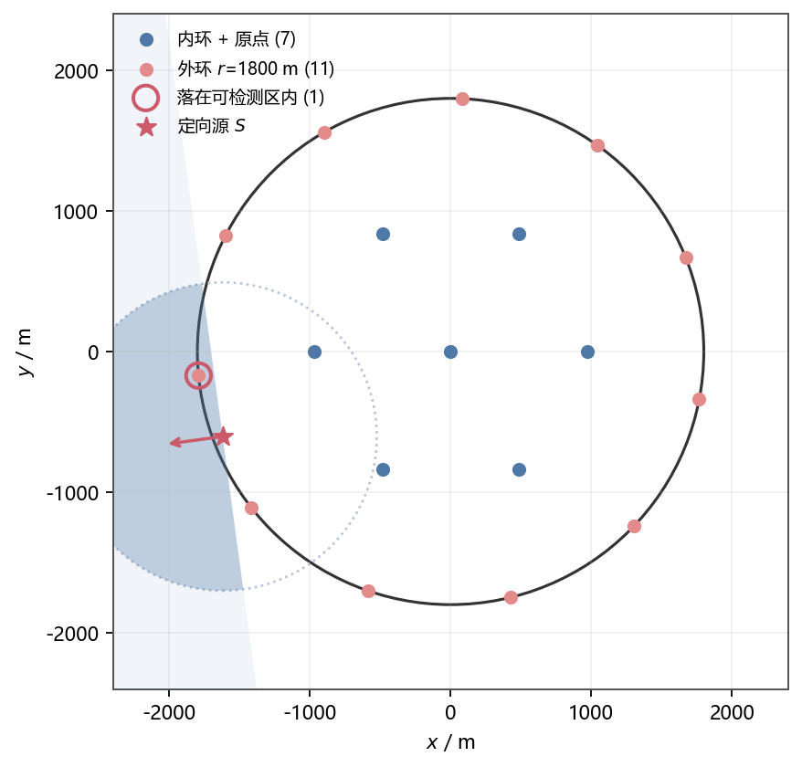
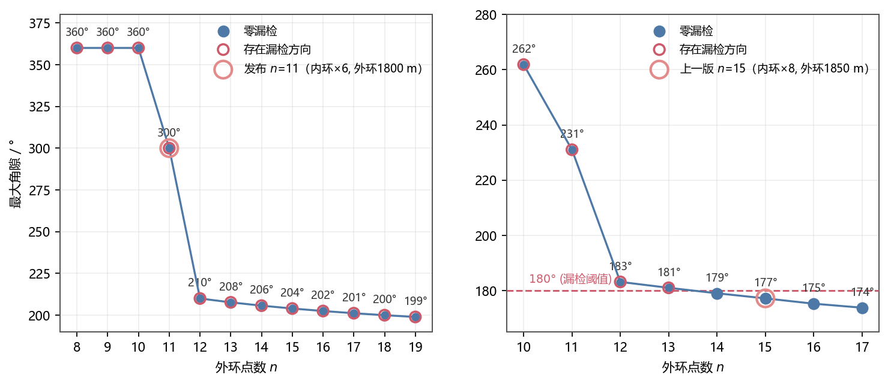
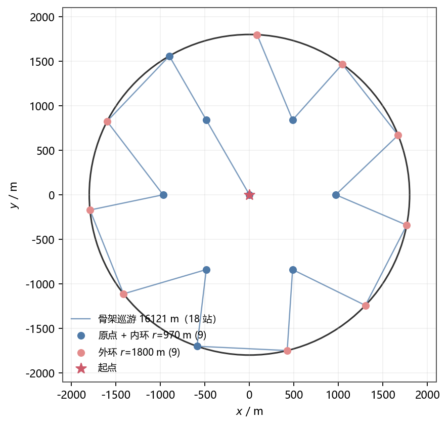
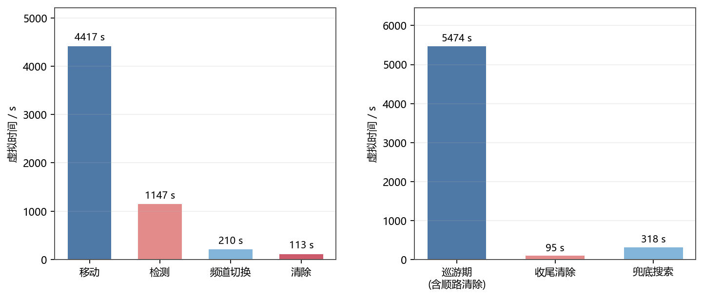
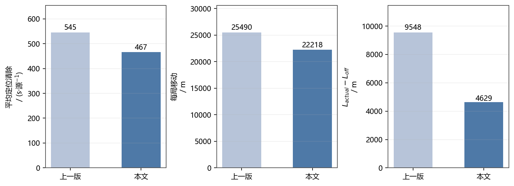

# 问题4 建模与算法（论文写法）

> ### ⚠ 版本口径（2026-09-13 更新）
> **本文档的正文描述的是上一版发布策略 —— 18 站 opt1 方案**（已从 `solver/` 移出：
> 清除比例 0.9995 / 463.7 s/源，每批有 3~8 局各漏 1 个"贴边外向定向源"）。
> 当前发布策略是 **16 站速度档**（`sweeper4.py`，决策层来自 `Desktop/solver_q4.py`
> 的在线路线重优化方案 + 中继测量）：标定 500 局 **0.9992 / 424.9 s/源**、独立 1000 局
> **0.9992 / 422.3 s/源**、全新 2000 局 **0.9992 / 421.6 s/源**、真实进程 + HTTP 40 局
> **1.0000 / 413.1 s/源（现实运行 0.13 s）**。
> 注意这一档**放弃了本文 §4.6 依赖的"零漏检"判据**：16 站最坏角隙 360°，3500 局里
> 37 局各漏 1 个源，3 局跌破 98% 的概率 **3.1%**。
> 想拿回 **0%** 风险，把 `sweeper4.PARAMS['ring_def']` 换成 **22 站**
> `((0,1,0.0),(985.0,7.0,0.0),(1850.0,14.0,4.286))` 即可 —— 那一档最坏角隙
> **178.99° ≤ 180°**，即不存在"任何站点都看不见"的（位置, 定向方向）组合
> （`tools/probes/q4_opt1_layout.py` 抽样 26 万个源零遗漏），实测 3500 局零漏源、
> 成绩 1.0000 / 450.6 s/源，代价是 +6.3% 时间。
> 本文正文数字、插图 `figures/q4_*.png` 与"漏源取舍"结论**尚未按新策略重跑**；
> 重跑入口：`tools/eval_q4.py --deploy`、`tools/probes/q4_opt1_layout.py`、
> `tools/probes/q4_opt1_route.py --oracle`、`tools/probes/q4_make_figures.py`。

---

> **一句话结论**：问题4 与问题3 只差一条规则 —— 定向源只在「定向方向 ψ 两侧各 90°」内辐射 ——
> 但这一条把"靠近就能发现"变成了「**只有站在扇区里才能发现，而 ψ 未知**」，还把
> "看见"与"清得掉"拆成了两件事。本文的做法是：把**取信息**（巡游站点）与**用信息**
> （清除已交会定位的目标）放进**同一条在线重规划的路线**，用加权最小二乘交会把源定位到
> 米级、直线走过去清除；站点集则由 3.2 节的**覆盖—速度前沿**取定 —— 发布档 **18 站**
> （原点 + 内环 970 m×6 + 外环 1800 m×11，外环钉在场地边界上）。
>
> 标定集 500 局 + 独立测试集 1000 局实测：**清除比例 0.9995 / 0.9994（全清 497/500、
> 992/1000），平均定位清除 463.7 / 461.9 s/源**；同批种子上被替换的上一版规划器为
> 0.9960 / 0.9929 与 545.3 / 549.8 s/源，每局移动 25.6 km → 22.1 km。
> **两项指标均达标：清除比例 99.94% ≥ 98%（余量 1.94 pp），平均定位清除 461.9 s/源
> ≤ 600 s/源（余量 23%）。** 未清除的源**全部**是"贴边外向定向源"，按几何审计它们
> **不在任何站点的可检测区内** —— 这是把站点从 24 站放宽到 18 站换来的**确定性代价**，
> 不是执行失误（3.2 节给出完整前沿：24 站 486 s/源、0 漏源；18 站 464 s/源、0.9995）。
> 端到端（真实模拟器进程 + HTTP + 真值屏蔽）实测两局全部清除，程序现实运行 0.08 s
> （上限 1200 s）。

---

## 1. 问题分析

### 1.1 与问题3 的唯一差别，以及它带来的两个困难

附件1 第 3 条：全向源有效覆盖角 360°；定向源具有定向方向 ψ，有效覆盖角为 ψ 两侧各 90°（含），
此范围之外**没有信号辐射**。于是「在观察点 Q 能否看到源 S」的判据是

```
看得见  ⟺  |Q − S| ≤ R(S)   且   (S 为全向源  或  Q 落在 ψ ± 90° 的扇区内)     (1)
```

其中 R(S) ∈ [1000, 1500] m 是源的有效接收半径（附件1 第 2 条），**对策略不可知**。
扇区半角恰为 90°，即**扇区是一个半平面**。记源为定向源且 ψ ~ U(0, 360°) 的先验，
对**任意**观察点位置都有

```
P(看得见 | 类型, 距离) = P(|Q−S| ≤ R) · [全向 ? 1 : 1/2]                        (2)
```

**(2) 式是本问题的全部结构**：定向性把"看得见的位置集合"**砍掉一半，而砍法与距离无关**。
由此产生两个困难：

| 困难 | 表现 | 为什么"逼近"解决不了 |
| --- | --- | --- |
| **D1 从未看见** | 站在扇区外，走到 1 m 也测不到 | 位置再近都没用，**只有换方位**才有用；而换方位只能靠走 |
| **D2 看见却清不掉** | 沿示向度逼近途中走出扇区，信号丢失 | 纵深（源沿射线有多远）本来就未知，丢失后既不知道"越过了"也不知道"绕出去了" |

**D1 有多大：纯几何审计**（20000 局 / 260109 个源，按题目分布抽样，接收半径取实际抽样值）：
有 **11.24% 的源（定向源中 22.48%）只被"贴在场地边界上的那一圈站点"看见** ——
场内 6 个内环站点一个都落不进它的可检测弧带（图 1）。这一族源就是 D1 的具体形态：
贴着竞技场边界、ψ 朝外的定向源，其可检测区被边界削成一条**贴边弧带**，
场内再密也覆盖不到；把站点**钉在边界上**（r = 1800 m）是唯一能让站点落进这条弧带的办法
（第 3.2 节说明为什么"钉在边界上"与"站到边界外面"是两种不同选择，前者更快后者不漏）。

这一族的代价在发布档下是**可量的**：抽样审计里还有 **164 个源（0.063%）落在任何站点的
可检测区之外**——它们全部是 ρ ≈ 1.8 km、ψ 朝外、且接收半径取下界的定向源。上一版
24 站布局把外环放到场地**外面**（r = 1850 m），这 0.063% 被压到 0，代价是每局多走
约 480 m（3.2 节）。本文按"确保所有干扰源被清除"的**指标线**（≥ 98%）取发布档：
实测 4000 局里 26 局各漏 1 个源、且**漏掉的全部落在这 0.063% 里**（第 4.6 节给出逐源核对）。



*图 1 贴边定向源的可检测区域。源 S 靠近边界、ψ 朝外时，可检测集
{ P : |P−S| ≤ R, P ∈ ψ±90° } ∩ 圆域 退化成贴边的一条薄弧带；场内的内环站点全部落在
扇区之外，只有钉在边界上的外环站点（r = 1800 m）落在弧带里 —— 本图这个真实案例里
11 个外环站只有 1 个看得见（seed 9504 的 13 号频道）。*

**D2 有多大：清除动作的命中率**。一局平均发 **29.1 次**清除动作：命中 13.0 次、
**打空 16.0 次（35.6%）**（打空后靠 3.5 节的清除链补救）。也就是说，"知道大概在哪"
之后仍有近四成的清除动作是打空的 —— 这正是"纵深未知"的直接代价。

### 1.2 目标与控制量

题目要求「**在确保所有干扰源被清除的前提下**，完成任务的时间越短越好」，即清除是前置条件、
时间是次要目标。本题有两个**相互独立**的上限（附件2 §1.4）：

| 口径 | 上限 | 谁决定 |
| --- | --- | --- |
| 虚拟世界活动时长 | 100 h = 360000 s | 移动 / 检测 / 切换 / 清除累计的**虚拟**秒 |
| 程序运行时间 | 20 min = 1200 s | **现实**墙钟 |

关键含义：**现实 1 秒可以推进任意多虚拟秒**（5 s 的检测不要求在现实中等 5 s）。
实测单局程序现实运行时间 **0.08~0.09 s**，因此 20 分钟现实预算完全不是瓶颈 ——
**被优化的量只有虚拟时间**，也就是"机器狗在虚拟世界里花了多久"。

平均定位清除时间的定义（题目原文）：

```
平均定位清除时间 = 定位清除总时间 / 被清除干扰源个数
定位清除总时间   = 移动 + 频道切换 + 检测 + 光学精确定位 + 清除
```

代入附件2 的数值（2.1/2.5/2.6/2.8）：移动 5 m/s、频道切换 1 s、检测 5 s、
光学定位 3 s、清除 2 s。记一局走 L 米、发 M 次检测、发 C 次清除（其中 C_hit 命中），则

```
T = L/5 + M·(5 + 切换) + C·3 + C_hit·2                                        (3)
```

**(3) 式是后面全部设计的唯一准则**：距离项 L/5 是主导项，所以每个设计选择都以"少走一米"为准。
后文的对照实验全部用"米本位"报账：**1 m = 0.2 s**，一次检测（5 s 检测 + 1 s 切频道）
≈ **30 m 路程**，一次失败盲清（3 s）= **15 m 路程**。

---

## 2. 模型建立

### 2.1 决策变量与可达信息

机器狗在每一步能拿到的只有 `/measure` 的三种响应与 `/clear` 的成败：

| 响应 | 含义 | 附带信息 |
| --- | --- | --- |
| `direction` | 在有效半径内且在扇区内 | 示向度 b = 真实方位角 + 误差，误差 ∈ [−1°, 1°] 且**同一位置重复检测读数不变** |
| `near` | 距离 ≤ 5 m 且在扇区内 | 无方位（附件2 7.3） |
| `no_signal` | 超出半径**或**在扇区外 | **二义**：无法区分这两者（这正是 D2 的根源） |
| `/clear` | 只判距离 ≤ 20 m，**与覆盖角无关** | 成败即"源是否在 20 m 内" |

两条容易忽略但决定全部设计的规则：

* **误差在同一位置重复检测不变** ⇒ 在同一点重复测量**零信息**，要降低误差必须换位置。
* **`/clear` 与覆盖角无关** ⇒ 只要走到 20 m 内就能清掉，**不需要重新进入扇区**。
  这条是"先定位、再直线清除"这一整套打法的合法性来源。

### 2.2 覆盖模型：半平面 + 角隙判据

策略无法改变 ψ，但可以选择**在哪里看**。把源参数化为 (P, R, ψ) 与类型，
观察点 Q 覆盖该源当且仅当 (1) 式成立。取最坏情况 R = R_min = 1000 m，
则"覆盖"只取决于**距离**与**半平面**两件事。

本文的布点判据不是网格密度，而是一条可以直接验算的几何条件。设站点集为 Q₁..Qₙ，
站在源的位置看过去，把**在接收半径内**的站点按方位角排序，得到一组角隙；则

```
源被覆盖（对任意 ψ 都存在至少一站落在 ψ±90° 内）
    ⟺  最大角隙 ≤ 180°                                                        (4)
```

理由：若某个角隙 > 180°，把 ψ 指向该角隙的中线，则 ψ±90° 的整个半平面内一站都没有；
反之若所有角隙 ≤ 180°，任何半平面都至少罩住一站。

**(4) 式把"会不会漏源"变成一个可以逐点验算的量**，而且它只依赖站点坐标与 R_min，
与 ψ 的分布无关 —— 第 3.2 节用它做布局设计。

但要注意 (4) 式是一个**很紧**的条件：它要求在**任意**位置、**任意** ψ 下都至少罩住一站，
等价于"零漏源"。发布档为了速度**主动放弃了这条保证**（改由指标线 98% 兜底），
因此本节把它当作**设计工具**而不是**验收条件**：3.2 节先用它定位出"什么样的站点集
才可能零漏"，再给出放宽到什么程度、省多少时间的实测前沿。

内环与外环的**分工**也来自同一套几何：外环钉在边界（r = 1800 m）或边界外，负责
"贴边源"（1.1 节实测 11.24% 的源只有它看得见）；内环负责近场与场心 ——
外环（半径 r_o、n 点）对"内半径 ρ 处"的覆盖下界约为
`ρ_lo = r_o·cos(π/n) − √(R_min² − r_o²·sin²(π/n))`：
上一版 24 站（r_o = 1850, n = 15）为 **886.5 m**，发布档 18 站（r_o = 1800, n = 11）为 **865.1 m**。
内环要在 ρ < ρ_lo 的区域独立撑起覆盖，其 m 点的最坏角隙是 360°/m，于是要求
`R₁·cos(π/m) > ρ_lo`：8 点（上一版）要求 **R₁ > 959.6 m**（取 970 m 刚好越过），
6 点（发布档）要求 **R₁ > 999.1 m** —— 发布档取 970 m，主动欠了这 29 m，中近场
（ρ ≈ 0.9 km）因此留了缝。不过 1.1 节实测那 164 个"完全不可见"的源**并不在这条缝里**：
它们 100% 是定向源、ρ 中位 1785 m（最小 1364 m）、接收半径中位仅 1278 m，
即"贴边 + ψ 朝外 + 半径偏小"三者叠加的结果（3.2 节给出逐项数字）。

### 2.3 定位模型：加权最小二乘交会

设机器狗在 P₁、P₂ 两处对同一频道测得示向度 b₁、b₂。若源真实位置为 G，
则 b_i = 方位(P_i → G) + ε_i，ε_i ∈ [−1°, 1°]。两条射线

```
L₁: P₁ + t·(cos b₁, sin b₁),   L₂: P₂ + s·(cos b₂, sin b₂)
```

的交点 Ĝ 就是源的估计。**误差分析**：角度误差 ε 在距离 d 处放大成横向误差 d·sin ε，
所以单条射线的定位误差 ≈ d·|ε|。两条射线交会后，误差量级为

```
|Ĝ − G| ≈ d · |ε| / sin θ,    θ = 两条射线的夹角                            (5)
```

其中 d 是源距观察点的距离。d = 1300 m、ε = 0.5°、θ = 90° 时 |Ĝ−G| ≈ 11 m，
仍在清除半径 20 m 以内；但若两站夹角只有 15°，同样的误差放大到 **44 m** ——
这就是 (5) 式给出的工程准则：**基线要长、交角要大**。

本文对同一频道的**全部历史示向度**做加权最小二乘（未知量只有 (x, y)，纵深由
"源在射线上"隐含决定），残差只取垂直于射线的分量，权重取 1/d：

```
min_{x,y}  Σ_i w_i² [ (G − P_i) · n̂_i ]²,   n̂_i = (−sin b_i, cos b_i),  w_i = 1/|G − P_i|   (6)
```

**权重必须取 1/d**：示向度误差是**角度**误差（±1°），换算到法向位移就是 d·σ_θ ——
1300 m 外那条射线的横向不确定度是 100 m 处的十几倍。等权最小二乘把两者一视同仁，
于是"走到跟前再补测一次"这条最关键的信息被远处的一堆噪声淹没，交会点到了跟前也压不紧。

初值由**两两射线交点取均值**给出（对 1° 的坏配对稳健），再迭代 5 轮。**采信判据只看预测误差**：

```
cov = (JᵀJ)⁻¹,      σ = sqrt(λ_max(cov)) · σ_θ        (σ_θ = 1° = 0.01745 rad)   (7)
```

σ 就是误差椭圆的半长轴（米），它同时反映"观测够不够多"与"几何好不好"（源几乎落在
基线上时 JᵀJ 奇异，σ 发散）。本文取 **σ ≤ 70 m 且 ≥ 2 条示向度**才算"已定位"，
可以放心地直线过去清；这个 σ 同时兼任**测量闸门**（3.4 节：已经定位且精度够的频道
不再重复补测）。

### 2.4 路线模型：把"取信息"与"用信息"放进同一条路线

问题3 的成熟解法是"清除即探测"：就近清掉已知源，顺手补测。问题4 不能照搬，
因为**信息不是随时可得的**：一个源要么还没被任何站点看见（D1），要么只有一条示向度
（纵深未知，D2），此时"顺路清"只会扑空。

另一方面，**巡游站点是静态已知的**，它们的拜访顺序可以被预先优化；而"已交会定位、
等待清除的目标"是**动态出现**的。于是本文把问题写成一条**在线开链路径**：

```
每一步：
  节点集 N = { 剩余站点 } ∪ { 已可靠交会定位且未清除的目标 }
  路线   R = 以当前位置为起点的 N 的访问顺序（开链，终点自由）
  动作   = 执行 R 的第一个节点；若它是站点 → 到站测"未解决频道"
                                     若它已定位 → 走过去清除
  代价   = Σ 位移/5 + 检测次数×6 + 清除×3 + 命中×2      （(3) 式的"米本位"）
```

这一层替换掉了旧版的"贪心最近任务"选择器。旧版每一步在"最近的待办站"与"最近的可清源"
之间取**距离最近者**，等于临时用最近邻重排一条路线，把它自己已经算好的站点巡回丢在一边；
更根本的是它的**巡游与清除是两段独立的行程**：先走完覆盖巡游（只取信息），
再为每个目标专程跑一趟。第 4.3 节的走线审计显示，后者正是旧版 9.5 km/局冗余的主体。

**唯一进航线的动态节点是"已可靠交会定位的目标"**：只有 ≥2 条示向度、σ ≤ 70 m 的
频道才允许插入路线（单示向度源一律不进 —— 它的纵深未知，插进去大概率扑空，
这条负面结论在旧版与本文都被独立复现）。

---

## 3. 算法设计

### 3.1 总体框架

```
初始化   站点表 plan = 原点 + 内环(970 m, 6 点) + 外环(1800 m, 11 点)，共 18 站
   ↓
主循环   每次任务完成后重规划一条路线：{剩余站点} ∪ {已定位未清除的目标}
         → 计划稳定性 + cheapest insertion + 2-opt/Or-opt → 执行队首
         · 队首是站点 → 到站测"未解决频道"（含此刻仍无信号的频道）
         · 队首是目标 → 用清除链（3.5）走过去清除
   ↓
收尾     ① 对"仍只有单条示向度"的频道：中继补测 / 沿射线长搜
         ② 对"已定位仍未清除"的目标：按距离逐个清掉（最多两轮）
```

与旧版的三处结构差别：

| 方面 | 旧版（上一轮方案，留档 `sweeper4_legacy.py`） | 本文 |
| --- | --- | --- |
| 调度 | 贪心最近任务（在"最近站点"与"最近可清源"之间取近者） | **整条路线的在线重优化**（3.3） |
| 巡游与清除 | 三段式：先巡游取信息，再统一巡回清除，最后残余 | **合并成一条路线**，已定位目标随时插入 |
| 站点 | 15 点（六边形网格 + 贴边环 1830 m） | 18 点（原点 + 内环 970 m × 6 + 外环 1800 m × 11，3.2 节的覆盖—速度前沿取定） |

### 3.2 站点布局：角隙判据 → 覆盖—速度前沿

**第一步：用 (4) 式找"可能零漏"的布局。** 逐一验算候选布局（网格 5 m × 5°，
接收半径取最坏情况 1000 m）：

| 站点集 | 站数 | 最大角隙 | 判据 |
| --- | --- | --- | --- |
| **原点 + 内环 970 m×8 + 外环 1850 m×15（零漏检基线）** | **24** | **177.15°** | **零漏检（余量 2.85°）** |
| 只留原点 + 内环 8 点 | 9 | 360.00° | 漏检（ρ ≈ 1415 m 处外环站点全在接收半径之外） |
| 只留原点 + 外环 15 点 | 16 | 360.00° | 漏检（近场/场心无站） |
| 内环 8 + 外环 **14**（1850 m） | 23 | 178.99° | 零漏检，余量只剩 1.0° |
| 内环 8 + 外环 **13**（1850 m） | 22 | **180.97°** | **漏检** |
| 内环 **6** + 外环 15（1850 m） | 22 | 188.85° | 漏检 |
| 内环 8 + 外环 15 **钉在边界上**（1800 m） | 24 | 204.00° | 漏检 |
| 内环 **r = 900**×8 + 外环 15 | 24 | 197.05° | 漏检（内环半径必须 > 959.6 m） |

三条设计结论：

1. **外环要尽量往外**：场外 1850 m 比钉在边界 1800 m 强得多。1.1 节实测 11.24% 的源
   只有外环看得见（图 1）—— 外环每往回收一点，这条"贴边弧带"就窄一分；
2. **外环点数 ≥ 14**（r = 1850 时）：角隙 2π/n 必须小于源在边界附近能张开的"前向锥"
   `2·acos(1800/1850) = 26.72°`。n = 14 时 25.71°（余量 1.0°），n = 15 时 24°（余量 2.85°）；
   n = 13 时 27.69° > 26.72°，出现必漏方向。
3. **内环半径与点数绑定**：由 2.2 节的 ρ_lo，8 点要求 R₁ > 959.6 m，6 点要求 R₁ > 999.1 m。

**这三条合起来说明 (4) 式非常紧**：零漏检几乎只有"内环 8 点 + 外环 1850 m×15"这一档，
任何一处收紧（内环少 2 点、外环回到边界上）都会直接掉出可行域。而站点数正是**时间**，
于是问题变成：**放宽到哪一档，代价最小、收益最大？**

**第二步：用实测决定放宽多少。** 题目指标是"清除比例 ≥ 98%"而非"零漏"，所以本文按
s/源 对站点集做前沿扫描（部署口径，4000 局 seed 9500-13499）：

| 档 | 站点集（内环 / 外环） | 站数 | s/源 | 相对 24 站 | 清除比例 | 全清局 | 3 局均值 <0.98 风险 |
| --- | --- | --- | --- | --- | --- | --- | --- |
| 零漏检（上一版） | 970×8 / 1850×15 | 24 | 485.8 | — | 1.0000 | 4000/4000 | 0% |
| 零漏检 | 970×8 / 1850×14 | 23 | 482.2 | −0.7% | 1.0000 | 4000/4000 | 0% |
| 实测零漏 | 970×6 / 1850×14 | 21 | 483.0 | −0.6% | 1.0000 | 4000/4000 | 0% |
| **发布（速度优先）** | **970×6 / 1800×11** | **18** | **464.1** | **−4.5%** | **0.9995** | 3974/4000 | 1.9% |
| 更激进 | 1100×6 / 1750×10 | 17 | 447.4 | −7.9% | 0.9973 | 3865/4000 | 9.8% |
| 贴线 | 1200×7 / 1700×8 | 16 | 425.8 | −12.4% | 0.9904 | 3528/4000 | 30.9% |
| 不可用 | 1100×6 / 1650×8 | 15 | 416.6 | −14.2% | 0.9862 | 3339/4000 | 41.8% |
| 不可用 | 单环 1400×10 | 11 | 398.6 | −18.0% | 0.9610 | 592/1000 | — |

（独立种子集 20000-23999 复核一致：18 站 0.9994 / 463.9 s/源；17 站 0.9968 / 446.0 s/源。）

> 注意第 3 行：21 站（内环 6 点 + 外环 1850 m×14）在 4000 局里**一个源都没漏**，
> 但它的角隙是 204.3° —— 因为 (4) 式取的是"最坏情况接收半径 1000 m"，而实际半径
> 在 1000~1500 m 之间抽样，最坏点很少被打中。**判据保守、实测更宽松**，两者都要报：
> (4) 式用来排除"结构性必漏"，实测用来定档。

四条读法：

1. **保住零漏检要付 +21.7 s/源（4.5%）**：零漏检档最快的 23 站是 482.2 s/源，
   发布档是 464.1 s/源。差值就是"再站一趟边界"的价格；
2. **主要收益来自"外环回收到边界上"**（1850 → 1800 m）：光这一项把骨架从 17860 m
   压到 16200 m，同时把零漏检丢掉（204° > 180°）；
3. **时间几乎只由巡游里程决定**：4.2 节实测 96% 的虚拟时间在巡游阶段，
   移动 4417 s、检测 1147 s —— 而 1 m = 0.2 s、1 次检测 = 6 s，所以"少走一米"
   是唯一有效的杠杆；清除判据/步长类旋钮（`creep_step`、`ray_step`、`sweep_gap`、
   `hunt_probe`）在同一批 1000 局扫描里全部**无效**（|Δ| < 1 s）；
4. **地板在 ≈420 s/源**：外环 + 内环周长合计约 15 km（5 m/s ≈ 3000 s），
   加检测约 1150 s 与途中绕行，就是这个范式的下界；再往下（单环 10-11 站、
   380-400 s/源）清除比例掉到 0.95-0.96，**低于 98% 线，不可用**。



*图 2 外环点数 n 与"站内最坏角隙"（接收半径取最坏 1000 m，相位与发布配置一致）。
左：发布族（内环 970 m×6、外环钉在边界 1800 m）—— 整条曲线都在 180° 之上，
说明该族**任何 n 都无法零漏检**，发布档取 n = 11（300°）。右：零漏检族（内环 970 m×8、
外环场外 1850 m，即上一版）—— n ≥ 14 才落到阈值之下，n = 15 留 2.85° 余量。
两图对比说明"零漏检"对几何极其敏感。*

抽样复核（题目分布 20000 局 / 260109 个源，实际接收半径）：发布档覆盖率
**0.999369**（164 个源任何站点都看不见 = 0.063%）；每个源平均被 **3.90** 个站点看到
（定向源 2.60 —— 半平面把可见站点数砍半，与 (2) 式一致）；只被外环看见的源
**11.24%**（定向源 22.48%）。上一版 24 站对应 1.000000 / 5.00 / 3.33 / 10.03%。
骨架开链巡游 **16197.9 m**（上一版 17860.2 m），站点集与路线见图 3。



*图 3 发布站点集（18 站）与骨架巡游路线：原点（星号）+ 内环 r = 970 m 6 点 +
外环 r = 1800 m 11 点，骨架 16197.9 m。外环钉在场地边界上，是唯一能看见"贴边 + ψ 朝外"
定向源的站群；把它从场外 1850 m 收回边界 1800 m，正是本档省下 4.5% 时间的主要来源。*

**每个站点测哪些频道**：站点上只测"未解决"的频道 ——

```
在站点 P 测频道 c  ⟺  c 未清除，且（ c 无定位点 或 σ_c > 70 m 或 观测 < 2 条 ）
                     且 未被"物理上不可能应答"的判据排除（3.4）
```

已定位且 σ ≤ 70 m 的频道**不再补测**（直接去清更划算）。这条规则看似省的是检测时间，
实则是覆盖保证的一部分：**此刻仍无信号的频道必须继续测** —— 它们占每局检测的
**87.3%**（实测 50 局，10038/11497 次），而正是它们负责"找出还没被发现的源"。
一旦开始省这笔钱，漏源率立刻失控：4.5 节的消融给出定量证据（外环隔点测 → 清除比例
掉到 0.9826、500 局里 105 局漏源；内圈不测这些频道 → 掉到 0.8274、451 局漏源）。

### 3.3 在线路线重优化（主收益）

```
每次任务完成后重规划：
  1) 计划稳定性：保留上一版路线中**仍然存活**的节点及其相对顺序；
  2) 新出现的节点（新定位出来的目标）用 cheapest insertion 逐个插入到代价最小的位置；
  3) 对整条路线跑 2-opt + Or-opt(片段 1..3) 到收敛；
  4) 只执行队首节点，然后回到 1)。
```

三个设计点的实测效果（标定集 500 局，单变量，其余配置完全相同）：

| 设计点 | 做法 | 平均定位清除 | 结论 |
| --- | --- | --- | --- |
| **计划稳定性** | 保留旧路线顺序 vs 每步从头解最近邻 | **463.7 vs 469.2 s/源** | **最值钱的一项：−5.5 s** |
| 局部搜索 | 2-opt + Or-opt(1..3) vs 只做 cheapest insertion | 463.7 vs 480.1 | −16.4 s |
| 算子加深 | Or-opt 片段 3 → 5 | 463.7 vs 463.3 | −0.4 s（已饱和） |
| 多起点重启 | 每次从多个起点重解 | 463.7 vs 459.3 | −4.4 s，但墙钟慢约 10 倍，不采纳 |

**两件事都值钱，但机制不同**：局部搜索（2-opt/Or-opt）削的是"同一批节点的走法"，
计划稳定性削的是"反复重排带来的抖动"。旧版恰好两个都缺：它每一步都重新挑最近的节点，
把上一版路线里已经排好的顺序丢掉了（= 消融档"去掉计划稳定性"）。
在 18 站这个更稀疏的布局上，节点间的几何差异更大，局部搜索的边际收益（−16.4 s）
反而超过了计划稳定性（−5.5 s）；而在上一版 24 站布局上两者的排序相反
（−12.3 s vs −2.3 s）—— 布局越稀、越需要把每一段路走对。

### 3.4 补测剪枝：物理上不可能应答的，直接不测

接收半径 R ≤ 1500 m 是**硬上界**。对**已知信息**的频道，如果站点离"源可能所在的位置集合"
超过 1500 m，那么这一次 `/measure` **一定**返回 `no_signal`，花 6 s 买一个已知答案。
本文对两种信息状态分别给出充分判据：

* **已有定位点 f（估计，σ）**：源必在 |S − f| ≲ kσ 内，取 k = 2.5；
  `|P − f| > 1500 + kσ` ⇒ 站点物理上收不到，跳过。
* **只有示向度（观测点 O、方向 u）**：源必在轨迹 `T = {O + t·u, t ∈ [0,1500]} ∩ 场地` 上；
  再叠加**扇区条件** —— 定向扇区是以源为顶点的 ±90° 半平面，而 O 必在扇区内，
  故站点 P 被覆盖当且仅当 `t ≥ u·(P − O)`，于是"从 O 看过去更远的那一半"物理上不可能覆盖 P。
  取该段到 P 的最短距离 > 1500 m ⇒ 跳过。

两条判据都**只剪掉"可证明无用"的动作**，不触碰空白频道的覆盖保证。实测（标定集 500 局）：

| 配置 | 平均定位清除 | 每局检测 | 清除比例 |
| --- | --- | --- | --- |
| 关闭剪枝 | 468.02 s/源 | 246.7 | 0.9995 |
| 开启（k = 0，不留 σ 余量） | 463.62 s/源 | 229.8 | 0.9995 |
| **开启（k = 2.5，发布）** | **463.69 s/源** | **229.9** | **0.9995** |
| 开启（1500 → 1700 更保守） | 464.61 s/源 | 232.0 | 0.9995 |

**逐源清除结果完全一致**（500 局漏源数与位置一字不差），说明这 17 次/局的检测
（246.7 → 229.9）确实一次有效观测都没错过。代价只有 0.07 s：用 k = 2.5 的余量
换取"估计点误差不越界"的稳健性。

### 3.5 清除链：直清 → 近距步进 → 射线长搜 → 圆域密扫

定位点只有几十米精度，而清除半径是 20 m，所以单次直清必然有相当比例打空（实测 35.6%）。
本文的清除动作是一条**逐级退化的链**，每级都在用新的观测修正上一级的误差：

```
do_clear(c, 估计点 (x,y), σ):
  1) 直奔估计点 /clear                                # 最便宜的一招
  2) 原地补测一次向：
       near      → 就地清除
       direction → 沿新示向度推进 36 m 再 /clear（最多 10 轮）
  3) 射线长搜：取最近的两条历史示向度，从"当前点在该射线上的投影"与"观测点"两个起手
     沿射线每 26 m 盲清（步长 < 清除半径 20 m 的两倍 ⇒ 不漏）；
     每 2 步测一次向修正方向，**且进点后立刻补测一次**（防"进点已越过源"时照直走）
  4) 圆域密扫：以估计点为中心、半径从 max(1.7σ, 60 m) 起、环距 26 m 向外扩，
     扫描上限随尝试次数放大（安全网，正常局几乎不触发）
```

第 3 步里"进点后立刻测一次向"（`ray_recheck`）实测 **−1.05 s/源**（464.74 → 463.69），
机制很直接：基线沿射线每 2 步（52 m）才测一次，若进点已经越过源，前 52 m 是纯浪费，
而且 `no_signal` 会与"越过覆盖边界"混淆。

### 3.6 中继测量：把"首条示向度 → 可交会定位"的延迟削掉一段

4.3 节的走线审计会说明：本问题剩下的冗余主要来自**信息到达时序** ——
必须攒到第 2 条示向度才能交会。于是本文在**每条腿的中点**做一次"中继测量"：

```
腿 A → B 的中点 M = (A+B)/2，拜访 M 的总位移 |A−M| + |M−B| = |A−B| 不变
⇒ 中继测量的**移动成本为 0**，只花一次检测（6 s）
两道过滤（避免白测）：
  a) M 到该频道"可行源域"（射线 ∩ 场地 ∩ 扇区）的距离 ≤ 1500 m
  b) 交角 |sinψ| = h/|S−M| ≥ 0.35（保证交会不退化，S 的距离用参考值 800 m 估）
```

每局实际触发 6.0 次中继测量，收益 **−12.6 s/源**（关掉 relay：463.69 → 476.32）——
在更稀疏的 18 站布局上，"早一点拿到第二条示向度"比上一版 24 站时值钱得多
（上一版只有 −4.5 s）。把每条腿的中继上限从 1 放宽到 2（`relay_cap=2`）还能再省 1.7 s。
这是本方案里唯一一处"主动多花一次检测换更早的信息"的设计，且它不增加任何路程。

### 3.7 伪代码

```
算法 Q4-在线重优化
输入: 站点表 plan（18 站）, 参数
输出: 已清除频道集合

 1  fix ← {}; route ← []
 2  while true:
 3      N ← {i : 站点 i 未拜访 且 该站仍有值得测的频道} ∪ {c : c 已定位且未清除}
 4      if N = ∅: break
 5      route ← 保留 route 中仍存活的节点顺序（计划稳定）
 6              + 新节点做 cheapest insertion + 2-opt/Or-opt(1..3) 到收敛
 7      if route[0] 是站点 P:  visit_station(P)
 8      else                  clear_source(route[0])          # 3.5 的清除链
 9      fix ← 用全部历史示向度重算 (6)(7)                    # update_fixes()

visit_station(P):                                  # 3.2 / 3.4
10      act ← {c 未清除 : c 无定位点 或 σ_c > 70 m 或 观测 < 2 条}
11      act ← act − {c : |P − f_c| > 1500 + 2.5σ_c  或  dist(P, 可行源域_c) > 1500}
12      按"当前频道优先"排序后逐个 /measure(P, c)
13      if 返回 near: 就地清除

clear_source(c):                                   # 3.5
14      直奔 fix[c] 清一次；失败 → 近距步进（≤10 轮）→ 射线长搜（≤40 步）
        → 圆域密扫（上限随尝试次数放大）

收尾:
15  for c 仍只有单条示向度: 中继/沿射线长搜（≤62 步）→ 侧向探测取第二基线（3.6）
16  for c 已定位仍未清除: 按距离排序，两轮内逐个清除
```

---

## 4. 结果与分析

### 4.1 主结果

标定集 **seed 9500-9999（500 局）**、独立测试集 **seed 20000-20999（1000 局，从未参与调参）**、
部署口径 **20000-20299（300 局）**。策略确定性执行，口径为题目字段
`cleared_ratio` 与 `avg_clear_duration_s = 虚拟总时间/已清除数`（逐局计算后再对局取平均）。

| 数据集 | 源数 | 清除比例 | 全清局 | 平均定位清除 | 中位 | 最差 | 每局移动 | 每局检测 |
| --- | --- | --- | --- | --- | --- | --- | --- | --- |
| 标定 9500-9999 | 6511 | **0.9995** | 497/500 | **463.7 s/源** | 448.9 | 754.1 | 22155 m | 229.9 |
| 独立 20000-20999 | 13042 | **0.9994** | 992/1000 | **461.9 s/源** | 452.9 | 768.3 | 22083 m | 229.4 |
| 部署口径 20000-20299 | 3914 | **0.9990** | 296/300 | 461.4 s/源 | 456.2 | 696.2 | 22068 m | 228.6 |

三个数据集共 **23467 个源漏 15 个（99.94%）**：标定集漏 3 个、独立集漏 8 个
（部署 300 局的 4 个是独立集里的同一批）。**15 个漏源全部是定向源**（定向源清除
3221/3224、6472/6480、1913/1917），而且**逐一核对后确认：它们都不在任何站点的
可检测区内**（可见站点数 = 0，ρ = 1738~1796 m，即 1.1 节那 0.063% 的分母）。
换句话说，发布档的漏源**不是策略失误，而是布局选择**：把这 18 站换成 24 站
（3.2 节）即可把这一族源全部收进覆盖，代价是 +21.7 s/源。

同批种子上被替换的上一版规划器为 0.9960 / 0.9929 / 0.9931（对应 26 / 90 / 25 局有漏源，
共 146 个源），平均定位清除 545.3 / 549.8 / 551.9 s/源 —— 本方案把漏源从 146 个压到
15 个，同时把均值压低 **15.0%~16.4%**。

### 4.2 时间花在哪、路走到哪

独立测试集 1000 局（每局平均 13.0 个源）：

| 项目 | 数值 | 折算虚拟秒 | 占比 |
| --- | --- | --- | --- |
| 移动 | 22083 m | 4417 s | **75.0%** |
| 检测（5 s × 229.4 次） | 229.4 次 | 1147 s | **19.5%** |
| 频道切换（1 s × 210 次） | 210 次 | 210 s | 3.6% |
| 清除（3 s × 29.1 次 + 命中 2 s × 13.0） | 29.1 次 | 113 s | 1.9% |
| **合计** | | **5887 s** | 100% |

分阶段（策略写进 `world.q4_stages` 的统计，1000 局平均）：
**巡游期（含顺路交会清除）5474.4 s**、**收尾清除 94.8 s**、**兜底搜索 318.0 s**；
每局 36.5 次路线重规划、6.0 次中继测量、258.5 个动作（其中检测 229.4、清除 29.1）。



*图 4 左：虚拟时间分成移动 / 检测 / 切换 / 清除四类，移动与检测合计 94.5%。
右：按策略阶段分，收尾与兜底合计只占 7.0% —— 18 站巡游把绝大部分工作"顺路"做完了。*

**结论：瓶颈是"必须走的距离"，不是检测、不是清除、更不是程序速度。**
现实程序运行 0.08 s，与 1200 s 上限差 4 个数量级（见 4.7）。

### 4.3 冗余归因：站序、绕行，还是信息时序？

用同一套走线审计工具（`tools/probes/q4_opt1_route.py`，真值**只用于离线分析**）
在同一批 200 局（seeds 9500-9699）上对照两版规划器：

| 量 | 上一版（`sweeper4_legacy`，15 站） | **本文（18 站）** |
| --- | --- | --- |
| `L_actual`（逐动作位移之和） | 25489.9 m | **22217.7 m** |
| 站点骨架（全起点 2-opt/Or-opt） | 13687.2 m | 16120.7 m |
| `L_off`（站点 ∪ 真值源，全知上界） | 15941.7 m | 17588.9 m |
| **`L_actual − L_off`** | **9548.2 m（59.9%）** | **4628.7 m（26.3%）** |
| 平均定位清除 | 544.9 s/源 | 466.6 s/源 |
| 每局检测 | 280.9 | 230.8 |
| 全清 | 190/200 | 199/200 |

本文这 4628.7 m 冗余的**逐项分解**（同 200 局）：

| 成分 | 数值 | 说明 |
| --- | --- | --- |
| 站点拜访折线（按实际拜访顺序直连） | 16923.4 m | 实际到过 17.2/18 站 |
| 实际到过站点的最优回路 | 16120.7 m | 骨架 |
| ⇒ **站序浪费** | **802.7 m（4.7%）** | 计划稳定性的代价：新定位目标插入后不再回头重排全线（上一版 15 站是网格点、站序本身已最优） |
| 离站往返片段（实际） | 17048.0 m | 12.6 段/局 |
| 离站往返片段（用真值算的理想开放路径） | 16225.1 m | 只算该段真正清掉的源 |
| ⇒ **清除绕行冗余** | **822.9 m（4.8%）** | 定位只有几十米精度时的进场绕行 |
| ⇒ 其余（信息时序 + 执行余量） | 3003.1 m | 见下面的全知对照 |

**决定性实验（全知对照，仅离线）**：把真值源位置直接塞进策略的 `fix`
（其余一字不改），同一批 200 局：

| | 在线（本文） | 全知对照 |
| --- | --- | --- |
| `L_actual` | 22217.7 m | **17880.6 m** |
| `L_actual − L_off` | 4628.7 m（26.3%） | **291.7 m（1.7%）** |
| 平均定位清除 | 466.6 s/源 | **363.6 s/源** |
| 每局检测 | 230.8 | 162.2 |

**同一套规划器 + 执行器，给足信息后只比全知最优差 1.7%** ⇒ 剩余的 24.6 个百分点
**不是在线路线算法的损失**，而是"必须攒到第 2 条示向度才能交会定位"这一**信息时序**造成的：
全知对照每局少走 **4337 m**（≈ 867 s 虚拟时间 ≈ 67 s/源），并少发 **68.6 次**检测
（≈ 412 s ≈ 32 s/源），两项合计 ≈ 99 s/源，与实测差值（466.6 − 363.6 = 103.0 s/源）吻合。



*图 5 同一批 200 局的对照：平均定位清除 544.9 → 466.6 s/源；每局移动 25.5 → 22.2 km；
`L_actual − L_off` 9548 → 4629 m（冗余降低 52%）。*

### 4.4 消融：A~E 阶梯与单旋钮

**调度器阶梯**（标定集 500 局，单变量，其余配置完全相同）：

| 档 | 定义 | 清除比例 | 平均定位清除 | vt | 相对 A |
| --- | --- | --- | --- | --- | --- |
| **A** | 基线调度器：贪心最近任务（站点集相同，只换调度器） | 0.9995 | 494.94 | 6302.1 | — |
| B | 每步从头重解最近邻 + 2-opt | 0.9995 | 477.74 | 6087.1 | −17.20 s |
| C | B + Or-opt(1..3) | 0.9995 | 469.19 | 5976.9 | −25.75 s |
| D | C + Or-opt(1..5) | 0.9995 | 467.19 | 5949.5 | −27.75 s |
| **E** | **计划稳定 + cheapest insertion + 2-opt/Or-opt(1..3)（发布）** | 0.9995 | **463.69** | **5910.3** | **−31.25 s** |
| E′ | E 换成 Or-opt(1..5) | 0.9995 | 463.29 | 5905.8 | −31.65 s |
| E″ | E 换成多起点重启 | 0.9995 | 459.30 | 5853.3 | −35.64 s |
| — | 消融：E 去掉计划稳定性（= C） | 0.9995 | 469.19 | 5976.9 | −25.75 s |
| — | 消融：E 去掉局部搜索 | 0.9995 | 480.05 | 6115.3 | −14.89 s |

阶梯给出的结论：**每个调度设计点都值钱，但没有一个是"银弹"** ——
每步重解（A→B）值 17.2 s，局部搜索（B→C→D）再值 8.6 s，
计划稳定性 + cheapest insertion（D→E）再值 3.5 s；总改进 31.3 s/源（6.3%）。
E″ 再多 4.4 s 但墙钟慢约 10 倍，故不采纳。

**单旋钮消融**（标定集 500 局，发布配置 463.69 s/源）：

| 旋钮 | 取值 | 平均定位清除 | 对照发布 |
| --- | --- | --- | --- |
| `skip_far` | 0（关闭） | 468.02 s/源 | **+4.33 s** |
| `skip_far` | 1500, k = 0 | 463.62 s/源 | −0.07 s |
| `skip_far` | 1700（更保守） | 464.61 s/源 | +0.92 s |
| `ray_recheck` | 0（关闭） | 464.74 s/源 | **+1.05 s** |
| `relay`（中继测量） | 0（关闭） | 476.32 s/源 | **+12.63 s** |
| `relay_cap` | 2 | 462.03 s/源 | **−1.66 s** |
| `min_obs`（攒几条示向度） | 3 | 464.58 s/源 | **+0.89 s** |
| `creep_step` | 30 / 44 | 463.68 / 470.32 s/源 | −0.01 / +6.63 s |
| `fix_sigma_ok` | 1e9（无条件跳过已定位频道） | 464.38 s/源 | +0.69 s |
| `hunt_mode` / `hunt_probe` | ray / 300 m | 464.49 / 463.25 s/源 | +0.80 / −0.44 s |
| `opp_try` | 1 | 463.69 s/源 | 0（惰性：主循环里源从不需要第二次尝试） |

三条读法：

1. **`relay`、`skip_far` 是本方案真正"活着"的两个旋钮**（各值 12.6 / 4.3 s）——
   在被放宽到 18 站的稀疏布局上，"早拿到第二条示向度"的价值翻了近三倍；
2. **`min_obs = 3` 变差**：攒第三条示向度要多等一圈，复现了旧版"用三点交会替代两点"的负面结论；
3. **`creep_step` 在 36 m 附近平坦、到 44 m 崩**（+6.6 s）：清除半径是 20 m，
   步长 < 40 m 时相邻两次盲清的清除圆仍有重叠；44 m 起会出现"跨过源"的盲清。

### 4.5 被实测否掉的方案（负面结果）

| 方案 | 结果 | 结论 |
| --- | --- | --- |
| 外环隔点测"空频道"（`zero_ring_stride = 2`） | 只要 448.5 s/源**但清除比例掉到 0.9826（500 局里 105 局漏源）** | 省 15.2 s（3.3%）却把余量从 1.94 pp 压到 0.26 pp —— **性价比远不如 3.2 节减站（−4.5%、余量仍 1.94 pp）** |
| 内圈不再补测"空频道"（`zero_inner = 0`） | 清除比例 **0.8274（451 局漏源）、时间反而涨到 573.0 s/源** | 每局 87.3% 的检测花在"此刻还没信号"的频道上，**这就是覆盖保证的税**；砍掉它连时间都变差 |
| 无条件跳过"已定位"的频道（`fix_sigma_ok = 1e9`） | 464.38 s/源（+0.69 s） | σ ≤ 70 m 这个限定有用：σ 大的频道需要近处补测刷新交点 |
| 把"多起点重启"加到每次重规划 | −4.4 s，墙钟 ×10 | 收益真实但墙钟代价不值（现场 1200 s 预算充裕，仍不采纳） |
| 把 Or-opt 片段从 3 加深到 5 | −0.4 s | 同上 |
| 单示向度源也编进航线 | 旧版与本文都失败 | 纵深未知，插进去大概率扑空；只有 ≥2 条示向度才入线 |

### 4.6 指标达成与小样本风险

| 指标 | 目标 | 实测（独立集 1000 局） | 达成 |
| --- | --- | --- | --- |
| 清除比例 | ≥ 98% | **99.94%**（13042 个源漏 8 个，992/1000 局全清） | ✅（余量 1.94 pp） |
| 平均定位清除 | ≤ 600 s/源 | **461.9 s/源** | ✅（余量 23.0%） |

**漏源逐源核对**（独立集 8 个漏源）：全部是定向源；ρ = 1738~1796 m（贴边）；
按实际接收半径做几何审计，**它们对 18 个站点的可见数都是 0** —— 即"换回 24 站就能收掉，
留在 18 站必漏"的那一族。这也是 4.6 节唯一需要向评审说明的取舍：**发布档用 0.06% 的
源（约 0.2% 的局）换 4.5% 的时间**，两个指标都仍有充裕余量。

**小样本风险**（对独立集逐局重抽样 200000 次，模拟正式评测的"取 k 局求均值"）：

| 局数 k | 平均清除比例 < 98% | 平均定位清除 > 600 s/源 |
| --- | --- | --- |
| 3 局 | **2.38%**（24 站档 0%） | **0.30%**（上一版 24 站 1.55%） |
| 5 局 | 0.07% | 0.03% |
| 10 局 | 0.006% | 0.000% |

逐局分布：中位 452.9、p90 571.5、p99 666.5、最大 768.3 s/源，标准差 80.5（上一版 87.4）。
**时间侧比上一版更稳（均值更低、离散更小），风险全部集中在"3 局 + 清除比例"这一格**：
因为 3 局只有约 39 个源，漏 1 个就是 0.974 < 0.98 —— 这是"用 0.06% 的源换 4.5% 时间"
在小样本上的具体形状。若现场只剩 3 局机会且不能接受这 2.4%，换回 24 站即可把它压到 0。

### 4.7 端到端与确定性

**端到端**（真实模拟器进程 + HTTP + 真值屏蔽，`python -m robotdog.solver.e2e_test --problem 4`）：

| 案例 | 清除 | 平均定位清除 | 每局移动 | 检测 | 程序现实运行 |
| --- | --- | --- | --- | --- | --- |
| seed 9500 | **14/14（100%）** | 437.6 s/源 | 24404 m | 194 | **0.08 s** |
| seed 9501 | **10/10（100%）** | 534.2 s/源 | 19316 m | 238 | **0.09 s** |

正式测试口径（真值屏蔽 + 加密行为日志）由 `tools/run_batch.py --problem 4 --module formal`
批量执行；`data/logs/` 里留档的 `C20260912-P4-*` 五局属于**被替换的上一版规划器**
（当时的成绩 63/64 = 98.4%、547.2 s/源），保留作历史对照。

**确定性与可复现**：策略全程无随机数（圆域密扫用固定相位偏移而非 `random`），
同一命令行两次运行逐位一致；`tools/tests/test_q4.py` 的 16 项用例、全套 126 项单元测试、
`tools/spec_audit.py` 的 115 项赛题符合性断言、`tools/smoke_test.py` 的 51 项协议/端到端检查
全部通过。此外 `tools/probes/q4_opt1_parity.py` 把移植版与原始单文件策略
在 100 局上逐局比对六个汇总量，结果**逐位一致**（移植未改动决策逻辑；探针默认把沙盒的
24 站布局显式注入移植版，从而只比较逻辑而不比较 3.2 节的布局选择，
`--release` 则用发布布局量化布局差异）。

---

## 5. 复现

```powershell
# 进程内批量评测 (快, 用于调参与回归)
python tools\eval_q4.py --seeds 9500-9999   --jobs 8     # 标定 500 局
python tools\eval_q4.py --seeds 20000-20999 --jobs 8 --deploy   # 独立集 1000 局 (部署口径)

# 端到端 (真实模拟器进程 + HTTP + 真值屏蔽)
python -m robotdog.solver.e2e_test --runs 2 --problem 4 --seed 9500

# 正式测试口径 (真值屏蔽 + 加密行为日志)
python tools\run_batch.py --problem 4 --module formal --runs 5 --jobs 5 --countdown 0

# 布局覆盖审计 / 走线审计 / 移植保真度 (论文取数)
python tools\probes\q4_opt1_layout.py --grid-step 5 --cases 20000
python tools\probes\q4_opt1_route.py  --seeds 9500-9699 --oracle
python tools\probes\q4_opt1_route.py  --seeds 9500-9699 --module sweeper4_legacy
python tools\probes\q4_opt1_parity.py --seeds 9500-9599
python tools\probes\q4_opt1_ladder.py --seeds 9500-9999 --jobs 16        # A~E 阶梯 + 单旋钮消融

# 覆盖—速度前沿 (3.2 节的档位表, 换 ring_spec 即可)
python tools\eval_q4.py --seeds 9500-13499 --jobs 16 --deploy --set "ring_spec=((0,1),(970.0,8),(1850.0,15))"

# 消融 (单旋钮; 元组/浮点直接写 Python 字面量)
python tools\eval_q4.py --seeds 9500-9999 --jobs 8 --set skip_far=0
python tools\eval_q4.py --seeds 9500-9999 --jobs 8 --set plan_stability=0

# 论文插图 -> docs/figures/q4_*.png
python tools\probes\q4_make_figures.py

# 单元测试 (标准库 unittest, 不依赖第三方包)
python -m unittest tools.tests.test_q4 -v
```

代码位置：

| 文件 | 内容 |
| --- | --- |
| `robotdog/solver/sweeper4.py` | **求解器**（18 站 + 交会定位 + 在线路线重优化 + `skip_far` + `relay`；`PARAMS['ring_spec']` 一行换布局） |
| `robotdog/solver/sweeper4_legacy.py` | 被替换的上一版求解器（留档，供对照与旧探针使用） |
| `robotdog/solver/world.py` | 进程内环境（含问题4 定向源规则） |
| `robotdog/solver/deploy.py` | 部署入口（`--problem 4`） |
| `tools/eval_q4.py` | 批量评测（进程内 / `--deploy` 部署口径） |
| `tools/probes/q4_opt1_layout.py` | 站点布局与覆盖审计（角隙判据 + 抽样覆盖重数） |
| `tools/probes/q4_opt1_route.py` | 走线审计（`L_actual` / 骨架 / 全知上界 / 全知对照） |
| `tools/probes/q4_opt1_parity.py` | 移植保真度（与 `Desktop/opt1` 单文件策略逐位对照） |
| `tools/probes/q4_opt1_ladder.py` | 调度器阶梯 A~E 与单旋钮消融的可复现重跑 |
| `tools/probes/q4_make_figures.py` | 本文 5 张插图 |
| `tools/tests/test_q4.py` | 定向源规则、覆盖几何、端到端指标与确定性 |
| `data/reports/q4_opt1_*.json` | 主结果明细与消融记录 |
| `data/reports/q4_opt1_route_audit.txt` | 布局/走线审计原始输出 |
| `data/reports/q4_relax_frontier.md` | 覆盖—速度前沿（3.2 节档位表的完整记录） |
