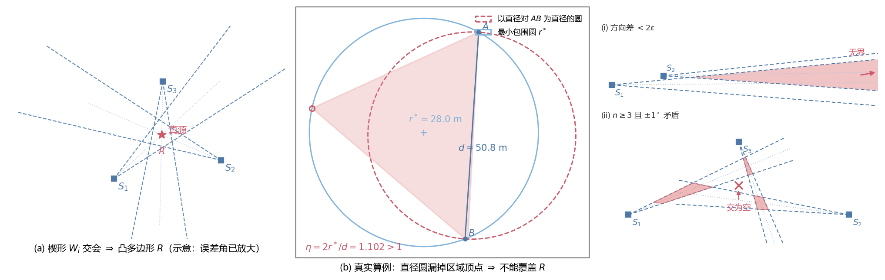
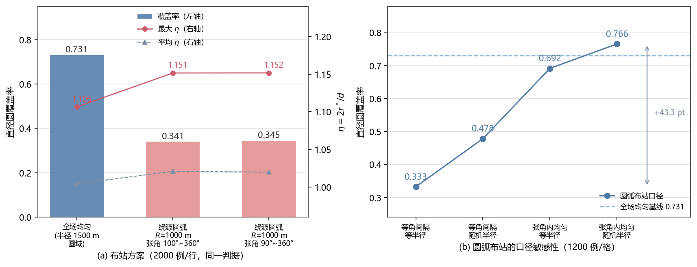
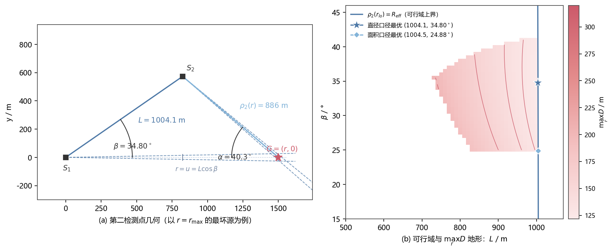
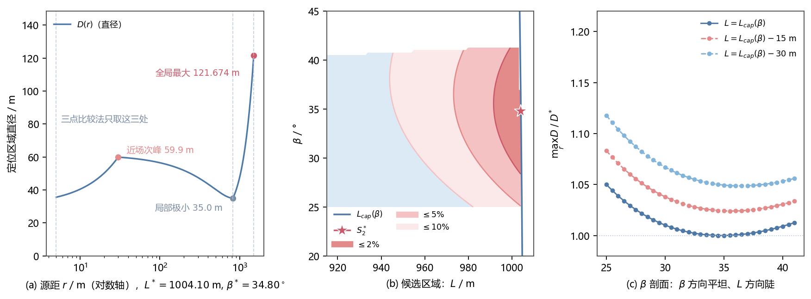

# B 题第一、二问最优方案（含精确直径优化）

> 2026 高教社杯数学建模竞赛 B 题「无线电干扰源的快速自动定位与清除」
> 本文是问题一、问题二的定稿：模型、算法与最终答案，含一项优化——用**精确直径**
> （而非一阶线性化近似）重解问题二的极小极大。
> 全部数字由本仓库脚本一键复现（§5）：`tools/probes/q12_review.py`。

---

## 0. 物理参数与符号

| 符号 | 含义 | 取值 |
| --- | --- | --- |
| `ε` | 示向度测量误差半宽 | `1°`（题面：误差落在 `[−1°,1°]`） |
| `R_eff` | 单源有效接收半径（案例给定，未知） | 题面 `[1000,1500] m`；本方案**保守取 1000 m** |
| `r` | 源到第一检测点 `S1` 的距离（**不可观测**） | `r ∈ [r_lo, r_max]` |
| `r_lo` / `r_max` | 源距下界 / 上界 | `5 m`（保守，题面依据：检测点距源 ≤5 m 时无示向度）/ `1500 m` |
| `L` / `β` | 第二检测点相对第一点的基线长度 / 侧偏角（决策变量） | `L>0`，`0<β<90°` |
| `D` / `A` | 定位区域（楔形之交）的直径 / 面积 | 问题二的两个并列口径 |
| `d` / `r*` | 凸多边形直径 / 最小包围圆半径 | 问题一 |
| `η` | 亏损比 `2r*/d` | `∈ [1, 2/√3]` |
| `e1` / `e2` | 两站示向度的**实现误差** | `∈ [−1°,1°]` |

---

## 1. 问题一：直径圆能否覆盖定位区域

### 1.1 模型

1. 检测点 `S_i` 的示向度 `θ_i`（±1°）把源限制在**楔形** `W_i = {P : |∠(P−S_i, θ_i)| ≤ 1°}`。
2. 每个楔形是两条半平面的交，`n` 个楔形 ⇒ **2n 条半平面**，用 Sutherland–Hodgman
   逐条裁剪求交，得到**凸多边形** `R`（顶点 `V_1,…,V_m`）。
3. 区域直径 `d = max_{P,Q∈R} |P−Q|`；最小包围圆半径 `r*`（Welzl）。
4. 覆盖判据（三种说法等价，任取其一，结论与直径对的选择无关）：
   * `R` 被「以直径对 `A,B` 为直径的圆」覆盖 ⟺ 对每个顶点 `(V_i−A)·(V_i−B) ≤ 0`（Thales）；
   * `R` 被某个半径 `d/2` 的圆覆盖 ⟺ `r* ≤ d/2`；
   * 记 `η = 2r*/d`，则覆盖 ⟺ `η = 1`（因 `r* ≥ d/2` 恒成立，且 `η = 1` 时最小包围圆的
     直径必然就是一对直径点）。用**非直径对**去检验会误判，这一点要在论文里写明。

**两类退化情形必须在算法里显式处理**：若两条示向度的方向差 `< 2ε = 2°`，两楔形的方向区间
重叠，交区域**无界**、直径无穷；`n ≥ 3` 时 ±1° 误差还可能使 `2n` 条半平面**交为空**（数据
自相矛盾）。算法应分别返回「无界」「空」标记，而不是先裁剪到包围盒再报一个有限直径——
否则覆盖率统计会被污染。



*图 1 楔形交会与"直径圆不能覆盖"。左：三站 $\pm1^\circ$ 楔形（$W_i$ 为两条半平面之交）相交得
凸多边形 $R$（示意，误差角已放大）；中：$\eta\approx1.10$ 的一个真实算例（取自 §1.3 的均匀
布站采样器），以直径对 $AB$ 为直径的圆（玫红虚线）漏掉 $R$ 的顶点（红圈），故不能覆盖 $R$，
最小包围圆（浅蓝实线）才是正确的区域大小口径；右：两类必须显式处理的退化（示意，误差角已
放大，各站示向度用虚线画出、中心线用点线画出）——**上**：两站方向差 $<2\varepsilon$，两楔形
的方向区间重叠，交区域（粉）是一条通向无穷的带，直径发散；**下**：三站的示向轴线不共点，
三楔形两两相交（粉）、但无公共点，$\times$ 处是数据自洽时公共点应在的位置。算法遇到这两种
区域必须分别返回「无界」「空」标记，而不是一个被包围盒截出来的假直径。*

### 1.2 算法

| 步骤 | 算法 | 复杂度 |
| --- | --- | --- |
| 半平面交 | Sutherland–Hodgman | `O(n·m)` |
| 直径 | 旋转卡壳（暴力 `O(m²)` 自校验） | `O(m)` |
| 最小包围圆 | Welzl（暴力 `O(m⁴)` 自校验） | 期望 `O(m)` |
| 覆盖判据 | Thales / 圆心距 | `O(m)` |
| 无界 / 空判定 | 示向度方向差 <2° 判无界；裁剪后顶点表为空判空 | `O(n)` |

自校验（由本仓库脚本独立复核，`exp15_selfcheck`）：旋转卡壳 vs 暴力直径 200 例（凸多边形）
**最大误差 7.1e-15 m**（浮点零）；中心对称族 **300/300** 被覆盖。最小包围圆在复核脚本里用
暴力（枚举 2 点/3 点组合）求解，避开 Welzl 的递归实现细节——顶点数 `m ≤ 2n` 很少，代价可忽略。

### 1.3 答案

**一般不能覆盖。** 直径圆的问题正是"太小"：由 Jung 定理

```
d/2 ≤ r* ≤ d/√3，  η = 2r*/d ∈ [1, 2/√3 = 1.1547]
```

取等构型是**等边三角形**（`η = 2/√3 = 1.1547005384`，本方案验证到小数点后 10 位）；
中心对称构型（如正六边形、对径点对布站）`η = 1`，被覆盖。

**失效率由布站分布主导**（规范采样器，2000 例/行）：

| 布站方案 | 总体覆盖率 | 平均 `η` | 最大 `η` |
| --- | --- | --- | --- |
| 全场均匀：以源为心、半径 1500 m 圆域内均匀撒点 | **0.731** | 1.004 | 1.107 |
| 绕源等半径圆弧：`R=1000 m`，张角 `Θ ~ U[100°,360°]` | **0.341** | 1.021 | 1.152 |
| 绕源等半径圆弧：`R=1000 m`，张角 `Θ ~ U[90°,360°]` | **0.345** | 1.020 | 1.152 |

采样器口径（**必须随表一起给出**）：站点数 `n ~ U{3,…,6}`；示向度 = 真实方位角 + `e`，
`e ~ U[−1°,1°]`（故定位区域必含真源、非空）；表中无界 0 例、空 0 例。
这张表**对采样口径极为敏感**（`exp14_sampler_sensitivity`，1200 例/格）：站点在圆弧上由
**等角间隔**改为**在张角内均匀随机**，覆盖率就从 `0.333` 升到 `0.692`；半径再由固定
`1000 m` 改为 `[300,1500] m` 均匀，则升到 `0.766`——**反超全场均匀（0.731）**。
所以"绕源圆弧更差"只在"等角间隔 + 等半径圆弧"这一口径下成立，布站口径必须与数字
一起写进论文（实现见 `exp13_coverage_table`）。



*图 2 覆盖率的布站依赖与采样口径敏感性。左：三种布站方案的直径圆覆盖率与 $\eta$（2000 例/行，
采样口径见上表文字）；右：同一族"绕源圆弧"布站下，站点由等角间隔改为张角内均匀随机、半径由
固定 $1000$ m 改为 $[300,1500]$ m 均匀，覆盖率从 $0.333$ 升到 $0.766$，反超全场均匀的
$0.731$（1200 例/格）。即"绕源圆弧更差"只在"等角间隔 + 等半径"这一口径下成立。*

`n=2` 几乎总能覆盖（随机位形 4000 例 **98.8%**；其余 ~1.6% 即上述"两示向度方向差 <2°"的
无界退化）；`n ≥ 3` 覆盖与否取决于约束法向是否接近中心对称。
**正解**：报告区域大小时用**最小包围圆**，而不是直径圆。

---

## 2. 问题二：第二个检测点放哪

### 2.1 模型与可行域

第一点 `S1=(0,0)`、`θ1=0`、源 `G=(r,0)`；第二点 `S2 = L·u(β)`（`0<β<90°`）。

```
ρ2(r) = √(r² − 2rL cosβ + L²)
sin α = L|sinβ| / ρ2(r)          （α = 源处两示向度方向的交会角）
```

**极小极大**：`min_{S2 可行}  max_{r∈[r_lo, r_max]}  D(r; S2)`（主口径直径）或 `A(r; S2)`（并列口径面积）。

可行域（三项，均按"对 `r ∈ [r_lo, r_max]` 处处成立"理解）：

```
可探测性： ρ2(r) ≤ R_eff = 1000 m
交会角：   α(r) ∈ [25°, 155°]
网格范围： L ∈ [1000, 1100] m（只是搜索区间，不是物理约束）
```

* 可探测性约束的含义：该源的有效接收半径 `R_eff` 未知，只知 `∈ [1000,1500]`；要求
  `ρ2(r) ≤ 1000` 即"无论 `R_eff` 取哪个值，`S2` 都收得到该源信号"——这是保守口径。
  由于 `ρ2(r)` 关于 `r` 是凸函数、最大值必在区间端点取到，它等价于 `ρ2(r_lo) ≤ 1000` 且
  `ρ2(r_max) ≤ 1000` 两个条件。
* 几何后果：`ρ2(r_lo) ≤ 1000` 是**上方**约束，把基线卡在
  `L ≤ L_cap(β) = r_lo·cosβ + √(1000² − r_lo²·sin²β)`；`α(r_lo) ≥ 25°` 给出
  `β ≳ 25°`（保守档）/ `β ≳ 22.8°`（工程档）；`ρ2(r_max) ≤ 1000` 给出 `β ≲ 41.8°`
  （`α ≤ 155°` 不紧）。
  ⇒ 可行域是 `(L,β)` 平面上一块**有界**区域（图 3(b)）。



*图 3 第二检测点的几何构造与可行域。左：$S_1$、$S_2$、源 $G$ 与基线 $L$、侧偏角 $\beta$、
源处交会角 $\alpha$、第二站源距 $\rho_2(r)$ 的定义（以 $r=r_{\max}$ 的最坏源为例，虚线为
两站 $\pm1^\circ$ 楔形边界，横轴为第一站示向度方向 $r=u=L\cos\beta$ 处标出局部极小的源距）；
右：$(L,\beta)$ 平面上的可行域与 $\max_r D$ 地形，上界为 $\rho_2(r_{lo})=R_\mathrm{eff}$ 的
取等曲线 $L_\mathrm{cap}(\beta)$，白色为不可行区，色标与等值线单位为 m。两个口径的最优点
（★直径、◆面积）都落在 $L_\mathrm{cap}(\beta)$ 边界上，即基线必须贴着"第二站刚好还能
保证收到信号"的上限。*

### 2.2 精确直径与最坏源距

**`D(r)` 不单调，最坏值不能只比较 `{r_lo, r_max, u}` 三点。** 精确计算给出：`r ≈ 30 m` 处有
一个**近场局部极大**（`D ≈ 59.9 m`），`r = u = L·cosβ ≈ 824.7 m` 处局部极小（`D ≈ 35.1 m`），
`r = r_max = 1500 m` 处取全局最大（`D = 121.674 m`）。三点比较法会漏掉近场次峰，只是一个
近似；本方案对 `r` 细扫（3001 点）取精确最大。（本例漏掉的次峰远小于全局最坏，故不影响
答案，但结论必须这样表述。）

**边界退化为一维**：数值上 `max_r D` 与 `max_r A` 在可行域内随 `L` 严格单调下降，故最优解
必取到 `ρ2(r_lo)=1000` 的上限 `L_cap(β)`，二维搜索退化为一维 `β` 搜索（整片地形见图 3(b)）。



*图 4 最坏源距与候选区域（保守档 $r_{lo}=5$ m、$L^*=1004.10$ m、$\beta^*=34.80^\circ$）。
左：$D(r)$ 在近场 $r\approx30$ m 有次峰 $59.9$ m、在 $r=u=L\cos\beta\approx824.5$ m 处有
局部极小 $35.0$ m、并在 $r=r_{\max}=1500$ m 取全局最大 $121.674$ m——三点比较法（灰虚线）
会漏掉近场次峰；中：相对最坏直径 $121.674$ m 放宽 $2\%/5\%/10\%$ 的候选区域（浅蓝底为
可行但劣于 $10\%$，白底为不可行），水平集呈"沿 $\beta$ 宽阔、沿 $L$ 很窄"的走向，$\leq5\%$
带即正文表中的 $L=974\sim1004$ m、$\beta=26^\circ\sim41^\circ$；右：三条 $\beta$ 剖面
（基线分别取 $L_\mathrm{cap}(\beta)$ 与再缩 $15$ m、$30$ m），每条曲线在 $\beta$ 方向几乎
水平，而三条曲线之间有明显台阶——这是"$L$ 很尖、$\beta$ 很平"的直接证据。*

### 2.3 各口径的最终结果

**保守口径 `r_lo = 5 m`（有题面依据，附件 1）**：

| 口径 | `L*` | `β*` | 最坏直径 | 最坏面积 |
| --- | --- | --- | --- | --- |
| 面积（精确，α 约束下） | 1004.53 m | 24.88° | 127.94 m | **2278.6 m²** |
| 直径（精确，**主口径**） | **1004.10 m** | **34.80°** | **121.674 m** | 2508.5 m² |

**工程口径 `r_lo = 100 m`**：

| 口径 | `L*` | `β*` | 最坏直径 | 最坏面积 |
| --- | --- | --- | --- | --- |
| 面积（精确，α 约束下） | 1091.45 m | 22.78° | 109.65 m | **1831.1 m²** |
| 直径（精确，**主口径**） | **1086.24 m** | **29.05°** | **107.024 m** | 2018.2 m² |

> 面积口径的最优点由 `α(r_lo) ≥ 25°` 取等决定。若不做 α 约束，最优点会滑到
> `β* = 22.41° / 17.32°`（最坏面积 2265.7 / 1761.0 m²），但那两点的 `α(r_lo)` 只有
> `22.5° / 19.0°`，与 §2.1 的约束自相矛盾，故不采用。

### 2.4 最终答案

**第二个检测点**：沿示向度方向前进约 **1004 m**（保守）/ **1086 m**（工程），再侧偏
**34.8°** / **29.1°**，即 `S2 ≈ L*·(cosβ*, ±sinβ*)`（上下对称两点）。
最坏定位直径 **121.674 m**（保守）/ **107.024 m**（工程）。

**第二个检测点的候选区域**（题目明确要求；保守档 `r_lo = 5 m`，按"最坏直径相对最优值
放宽 5%"给出；水平集形状见图 4(b)）：

| 放宽幅度 | `β` 范围 | `L` 范围 |
| --- | --- | --- |
| ≤ 5% | `26° ~ 41°` | `974 ~ 1004 m` |
| ≤ 10% | `25° ~ 41°` | `942 ~ 1004 m` |

等价的工程说法：**基线取到"第二站刚好还能保证收到信号"的上限
`L ≤ r_lo·cosβ + √(1000² − r_lo²sin²β)`（保守档 `r_lo=5 m`），侧偏角在 25°~41° 之间。**
要点是"`L` 很尖、`β` 很平"：`L` 必须贴近上限，而 `β` 在 25°~41° 之间几乎同样好。
相对 `S1` 处测得的示向度方向给出即可。

归一化（便于现场套用）：`L*/r_max = 0.669`（保守）/ `0.724`（工程），`β* = 34.8° / 29.1°`
——即"沿示向度走到约 `0.67 ~ 0.72 r_max`，再侧偏约 `30°`"。

**稳健性（把 ±1° 误差也计入最坏情形）**：主口径只对未知源距 `r` 取最坏、把两站误差固定为 0。
若把 `(e1,e2)` 也纳入最坏情形（`max_{r,e1,e2} D`），保守档最优 `β*` 由 34.80° 移到 **37.0°**，
此时最坏直径 **134.06 m**（比原最优点的 121.674 m 增加 **10.2%**；若仍站在 `β=34.80°`，
同口径最坏值为 134.26 m）；工程档由 107.02 m 升至 117.02 m，`β*` 移到 31.0°。
最坏组合出现在 `e1=−1°、e2=+1°、r=1500 m`（真源落在两个楔形的对角边缘）。
**结论不变**：基线贴 1000 m、侧偏 30° 左右。

---

## 3. 精确直径 vs 一阶线性化近似

原路线用一阶线性化传播 ±1° 误差来近似直径，好处是最坏源距退化为端点/驻点的三点比较、
`O(1)` 可解。本方案用**半平面交精确算直径**替换它，重解极小极大：

| `r_lo` | 口径 | `L*` | `β*` | 最坏直径 |
| --- | --- | --- | --- | --- |
| 5 m | 一阶线性化近似（原方案） | 1004.10 m | 34.777° | 121.674 m |
| 5 m | **精确（本方案）** | 1004.10 m | 34.80° | 121.674 m |
| 100 m | 一阶线性化近似 | 1086.26 m | 29.025° | 107.024 m |
| 100 m | **精确（本方案）** | 1086.24 m | 29.05° | 107.024 m |

**精确与近似的最优解几乎重合**（`L*` 不变、最坏直径不变、`β*` 只差 0.02°~0.03°），且两种
口径的最优解都贴在 `ρ2(r_lo)=1000` 边界上。这同时确认：

1. **线性化近似在该候选区域足够精确**，用它当主口径没有隐藏误差；
2. 最优解贴边的性质**与口径近似无关**，是模型本身的几何结论；
3. 近似口径公布的数值与本方案的精确复核逐位一致（121.674 m / 107.024 m）。

**两口径互查**（都用精确计算）：`L*` 相差 **0.04%**，但 `β*` 相差 **9.9°**；用错口径各亏
**5.1%**（直径目标错用面积口径最优解）与 **10.1%**（面积目标错用直径口径最优解）。
若不做 α 约束，这两个数分别是 8.9% 与 10.7%。

---

## 4. 三处需要写进论文的"口径声明"

1. **问题一的布站分布与采样器必须写明**，并交代无界/空区域的处理：同一判据下，等角间隔
   的等半径圆弧布站覆盖率 0.33、全场均匀 0.73（差 40 个百分点）；但站点改为"张角内均匀
   随机 + 半径随机"后覆盖率升到 0.77，反超全场均匀。只写"随机布站"会让结论被误当成普遍。
2. **问题二的主口径用直径**（题目问"区域大小"，直径贴题；面积并列给出）。两口径 `L*` 只差
   0.04%，但 `β*` 差 9.9°；用错口径在直径目标上亏 5.1%、在面积目标上亏 10.1%。
3. **`r_lo` 取 5 m 作保守基线**（题面依据）、100 m 作工程档，两档都给：最坏直径相差 13.7%
   （121.674 m vs 107.024 m）。

---

## 5. 复现

```powershell
python tools\probes\q12_review.py       # 本文全部数字（一键，仅依赖 numpy）
python tools\probes\q12_make_figures.py # 图 1~图 4 -> docs/figures/q12_*.png
```

脚本从题目附录 2 的定义**独立实现**（楔形半平面交、旋转卡壳自校验、暴力最小包围圆），
不依赖其它版本的脚本与中间结果；确定性抽样（固定种子），两次运行逐位一致。

插图脚本复用同一套几何实现（不另算一套模型），四张图与正文图 1~图 4 一一对应：
`q12_q1_region`（楔形交会与直径圆失效）、`q12_q1_coverage`（布站与采样口径敏感性）、
`q12_q2_feasible`（几何构造与可行域）、`q12_q2_worst_r`（最坏源距与候选区域）。
